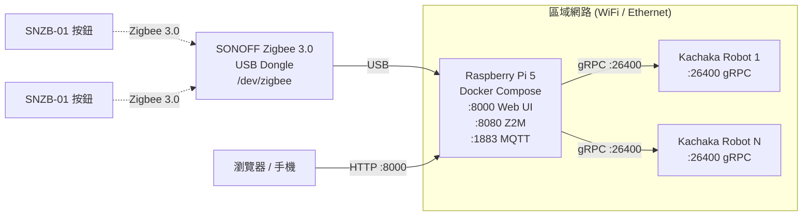
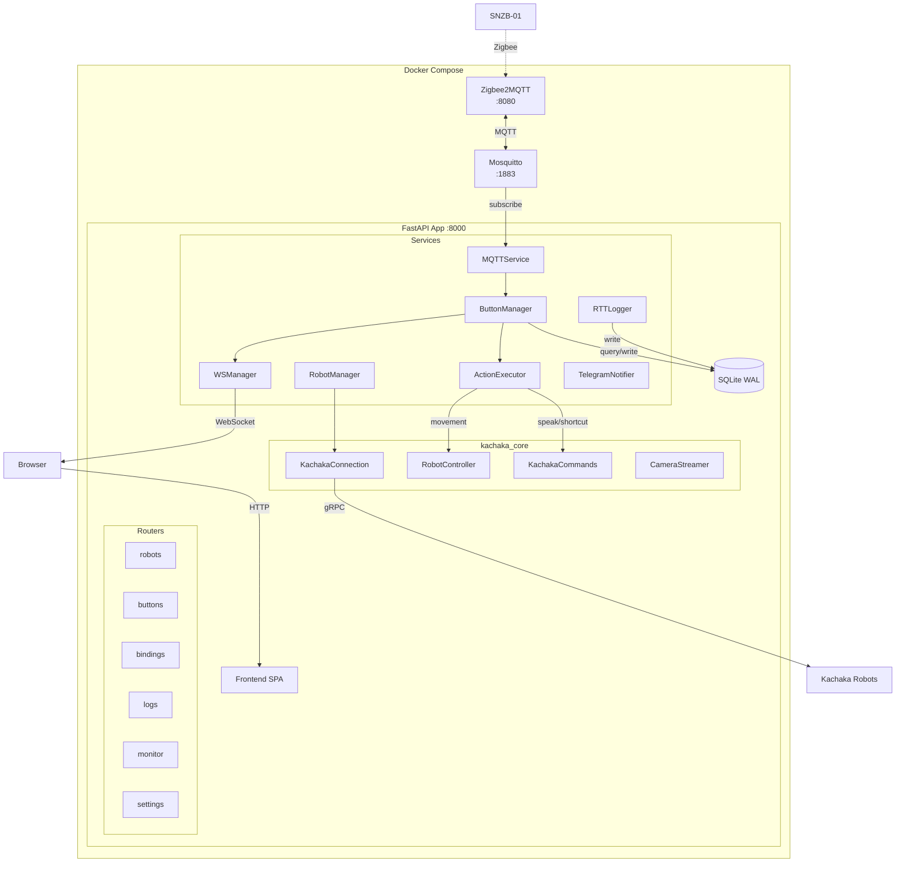
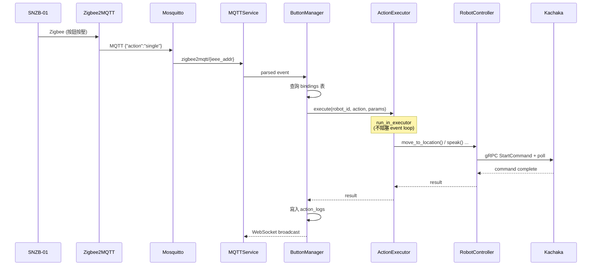
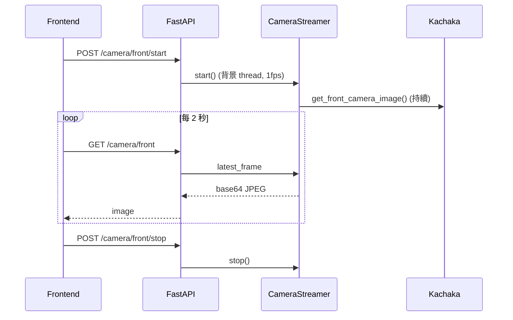
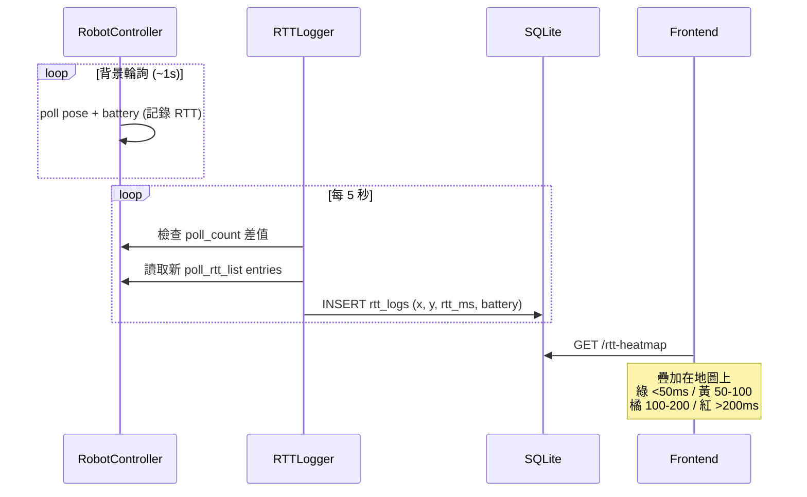

# Sigma 簡易控制介面

[](https://github.com/Sigma-Snaken/sigma-button-controller/actions/workflows/build.yml)
[](LICENSE)

Zigbee 按鈕 → Kachaka 機器人控制器，運行於 Raspberry Pi 5。透過 Web UI 配對 SONOFF SNZB-01 Zigbee 按鈕，將單擊/雙擊/長按綁定到 Kachaka 機器人動作（移動、搬運貨架、語音播報等），一鍵即觸發。

## 功能

- **多機器人管理** — 動態新增/移除 Kachaka 機器人，即時狀態、電量、序號
- **Zigbee 按鈕配對** — Web UI 一鍵啟動 permit_join，自動偵測並記錄 SNZB-01
- **三觸發綁定** — 單擊/雙擊/長按各自綁定不同動作，參數（位置、貨架、捷徑）從機器人即時載入
- **8 種機器人動作** — 移動到位置、回充電座、語音播報、搬運/歸還貨架、對接/放下貨架、執行捷徑
- **機器人監控** — 即時地圖 + 位置標示、前/後鏡頭串流 (CameraStreamer)、RTT 網路效能熱力圖
- **執行記錄** — 完整動作歷史含錯誤代碼，支援分頁查詢
- **Telegram 通知** — 執行失敗時自動推送，可在 Web UI 設定與測試
- **RWD** — 桌面/平板/手機自適應佈局，手機版 FAB 浮動選單

## 技術棧

| 層級 | 技術 |
|------|------|
| 後端 | Python 3.12, FastAPI, uvicorn, aiomqtt, aiosqlite |
| 機器人 SDK | [kachaka-sdk-toolkit](https://github.com/Sigma-Snaken/kachaka-sdk-toolkit) (KachakaConnection, RobotController, CameraStreamer) |
| 前端 | Vanilla JS ES Modules (無 build step), CSS3 |
| 資料庫 | SQLite WAL, 版本化 migration (V1-V3) |
| 訊息佇列 | Eclipse Mosquitto 2 (MQTT broker) |
| Zigbee | Zigbee2MQTT + SONOFF Zigbee 3.0 USB Dongle |
| 容器 | Docker Compose (3 services) |
| CI/CD | GitHub Actions → GHCR (linux/amd64 + linux/arm64) |
| 套件管理 | uv (Dockerfile) |

## 硬體架構



所有服務（Mosquitto、Zigbee2MQTT、FastAPI App）皆運行於 Raspberry Pi 5 的 Docker Compose 環境中。Zigbee USB Dongle 透過 device passthrough 映射至 Zigbee2MQTT 容器。機器人透過區域網路 gRPC 連線。

## 軟體架構



### 啟動順序 (Lifespan)

1. SQLite 連線 + migration
2. 載入 Telegram 設定
3. 啟動 MQTT 訂閱 (`zigbee2mqtt/#`)
4. 連線所有已啟用的機器人 (RobotManager + RobotController)
5. 啟動 RTT Logger (5 秒間隔)

## 資料流

### 按鈕觸發 → 機器人動作



### 鏡頭串流



### RTT 網路效能圖



## 快速開始

### 硬體需求

- Raspberry Pi 5 (或任何 Linux 主機, amd64/arm64)
- SONOFF Zigbee 3.0 USB Dongle Plus (或相容 Zigbee coordinator)
- SONOFF SNZB-01 Zigbee 按鈕 (一個或多個)
- Kachaka 機器人 (一台或多台，同一區域網路)

### 生產部署 (Raspberry Pi)

```bash
# 1. 下載部署檔案
curl -L https://github.com/Sigma-Snaken/sigma-button-controller/archive/refs/heads/main.tar.gz | tar xz --strip=2 sigma-button-controller-main/deploy
cd deploy

# 2. 執行首次設定 (安裝 Docker、udev rule、建立目錄、桌面捷徑)
chmod +x setup.sh && ./setup.sh

# 3. 確認 Zigbee dongle 已被辨識
ls -la /dev/zigbee

# 4. 啟動 (從 GHCR pull image，不需本地 build)
cd /opt/app/sigma-button-controller
docker compose pull && docker compose up -d
```

> **⚠️ Zigbee Dongle 注意事項**
>
> `setup.sh` 會自動建立 udev rule，將 Zigbee dongle 固定為 `/dev/zigbee`（不受 USB 插拔、換 port 影響）。
>
> **預設規則針對 SONOFF Zigbee 3.0 USB Dongle Plus**（USB ID `10c4:ea60`, Silicon Labs CP2102）。
>
> **如果你使用不同廠牌的 Zigbee dongle**，需要手動修改 udev rule：
>
> ```bash
> # 1. 查詢你的 dongle USB ID
> udevadm info -a -n /dev/ttyUSB0 | grep -E 'idVendor|idProduct'
>
> # 2. 修改 udev rule（替換 idVendor 和 idProduct）
> sudo nano /etc/udev/rules.d/99-zigbee.rules
> # SUBSYSTEM=="tty", ATTRS{idVendor}=="你的值", ATTRS{idProduct}=="你的值", SYMLINK+="zigbee"
>
> # 3. 重新載入
> sudo udevadm control --reload-rules && sudo udevadm trigger
>
> # 4. 確認
> ls -la /dev/zigbee
> ```

### 開發環境

```bash
git clone https://github.com/Sigma-Snaken/sigma-button-controller.git
cd sigma-button-controller
docker compose up --build
# docker-compose.override.yml 自動套用：src/ volume mount + --reload
```

無 Zigbee dongle 時，App 仍可啟動（MQTT 連線會持續重試），可用於前端開發和 API 測試。

### 存取服務

| 服務 | URL | 說明 |
|------|-----|------|
| 控制介面 | `http://<PI_IP>:8000` | Web UI 主介面 |
| Zigbee2MQTT | `http://<PI_IP>:8080` | Zigbee 裝置管理 |

## 專案結構

```
sigma-button-controller/
├── src/
│   ├── backend/
│   │   ├── main.py                  # FastAPI app + lifespan 啟動序列
│   │   ├── routers/
│   │   │   ├── robots.py            # 機器人 CRUD + locations/shelves/shortcuts
│   │   │   ├── buttons.py           # 按鈕 CRUD + pair/stop
│   │   │   ├── bindings.py          # 綁定 GET/PUT (per button_id)
│   │   │   ├── logs.py              # 執行記錄 (分頁查詢)
│   │   │   ├── monitor.py           # 地圖、鏡頭 (CameraStreamer)、RTT 熱力圖
│   │   │   ├── settings.py          # 系統資訊、Telegram 通知設定
│   │   │   └── ws.py                # WebSocket 端點
│   │   ├── services/
│   │   │   ├── robot_manager.py     # RobotManager + RobotService (kachaka_core)
│   │   │   ├── action_executor.py   # 非同步執行, RobotController/KachakaCommands 分流
│   │   │   ├── mqtt_service.py      # aiomqtt 連線 + Zigbee2MQTT 訊息解析
│   │   │   ├── button_manager.py    # 配對流程 + 綁定查詢 + 動作分派
│   │   │   ├── rtt_logger.py        # 背景 RTT + pose 記錄 (poll_count delta)
│   │   │   ├── ws_manager.py        # WebSocket 廣播管理
│   │   │   └── notifier.py          # Telegram Bot API 通知
│   │   ├── database/
│   │   │   ├── connection.py        # aiosqlite + WAL + foreign_keys
│   │   │   └── migrations.py        # V1: 核心表, V2: settings, V3: rtt_logs
│   │   └── utils/
│   │       └── logger.py
│   └── frontend/
│       ├── index.html               # SPA 入口 (5 個 Tab)
│       ├── favicon.png
│       ├── css/style.css            # Vintage Command Terminal 主題 + RWD
│       └── js/
│           ├── app.js               # Tab 路由 + FAB 選單 + toast/modal
│           ├── api.js               # REST API 封裝 (22 個端點)
│           ├── websocket.js         # WebSocket 自動重連
│           ├── robots.js            # 機器人管理頁面
│           ├── buttons.js           # 按鈕配對頁面
│           ├── bindings.js          # 綁定設定頁面 (含動態參數載入)
│           ├── logs.js              # 執行記錄 + Telegram 設定頁面
│           └── monitor.js           # 地圖 + 鏡頭 + RTT 熱力圖頁面
├── deploy/
│   ├── docker-compose.yml           # 生產用: GHCR image + IPv4 強制
│   └── setup.sh                     # 首次部署腳本 + 桌面捷徑
├── mosquitto/
│   └── mosquitto.conf               # Mosquitto broker 設定
├── zigbee2mqtt/
│   └── configuration.yaml           # Zigbee2MQTT 設定
├── tests/                           # 37 個測試
├── docker-compose.yml               # 開發用: local build
├── docker-compose.override.yml      # 開發用: volume mount + --reload
├── Dockerfile                       # Python 3.12-slim + uv
├── .github/workflows/build.yml      # CI: cross-compile amd64+arm64 → GHCR
└── requirements.txt
```

## API 端點

| Method | Endpoint | 說明 |
|--------|----------|------|
| `GET` | `/api/health` | 健康檢查 |
| `GET` | `/api/robots` | 機器人列表 (含 online/battery/serial) |
| `POST` | `/api/robots` | 新增機器人 (自動連線) |
| `PUT` | `/api/robots/{id}` | 更新機器人 |
| `DELETE` | `/api/robots/{id}` | 刪除機器人 |
| `GET` | `/api/robots/{id}/locations` | 位置清單 (from robot) |
| `GET` | `/api/robots/{id}/shelves` | 貨架清單 (from robot) |
| `GET` | `/api/robots/{id}/shortcuts` | 捷徑清單 (from robot) |
| `GET` | `/api/robots/{id}/map` | 地圖 (base64 PNG) + 即時位置 |
| `GET` | `/api/robots/{id}/camera/{front\|back}` | 鏡頭影像 (base64 JPEG) |
| `POST` | `/api/robots/{id}/camera/{cam}/start` | 啟動 CameraStreamer |
| `POST` | `/api/robots/{id}/camera/{cam}/stop` | 停止 CameraStreamer |
| `GET` | `/api/robots/{id}/metrics` | RobotController RTT 統計 |
| `GET` | `/api/robots/{id}/rtt-heatmap` | RTT 資料點 + 統計 |
| `DELETE` | `/api/robots/{id}/rtt-heatmap` | 清除 RTT 資料 |
| `GET` | `/api/buttons` | 按鈕列表 |
| `PUT` | `/api/buttons/{id}` | 重命名按鈕 |
| `DELETE` | `/api/buttons/{id}` | 刪除按鈕 |
| `POST` | `/api/buttons/pair` | 啟動配對 (120 秒) |
| `POST` | `/api/buttons/pair/stop` | 停止配對 |
| `GET` | `/api/bindings/{button_id}` | 查詢綁定 |
| `PUT` | `/api/bindings/{button_id}` | 更新綁定 (single/double/long) |
| `GET` | `/api/logs?page=N` | 執行記錄 (分頁) |
| `GET` | `/api/system/info` | 系統 URL |
| `GET` | `/api/settings/notify` | Telegram 設定 |
| `PUT` | `/api/settings/notify` | 更新 Telegram 設定 |
| `POST` | `/api/settings/notify/test` | 測試通知 |
| `WS` | `/ws` | WebSocket 即時事件 |

### WebSocket 事件

| 事件 | 說明 |
|------|------|
| `device_paired` | 新按鈕配對完成 |
| `pair_started` | 配對模式啟動 (含 timeout) |
| `pair_stopped` | 配對模式停止 |
| `action_executed` | 動作執行完成 (含 result) |

### 支援的動作

| 動作 | 參數 | 執行方式 |
|------|------|----------|
| `move_to_location` | `{name}` | RobotController |
| `return_home` | 無 | RobotController |
| `move_shelf` | `{shelf, location}` | RobotController |
| `return_shelf` | `{shelf}` (可空) | RobotController |
| `speak` | `{text}` | KachakaCommands |
| `dock_shelf` | 無 | KachakaCommands |
| `undock_shelf` | 無 | KachakaCommands |
| `start_shortcut` | `{shortcut_id}` | KachakaCommands |

## 資料庫

SQLite WAL 模式，3 個版本化 migration：

| 表 | 用途 | Migration |
|----|------|-----------|
| `robots` | 機器人登錄 (id, name, ip, enabled) | V1 |
| `buttons` | Zigbee 按鈕 (ieee_addr, battery, last_seen) | V1 |
| `bindings` | 按鈕-動作綁定 (trigger: single/double/long, UNIQUE) | V1 |
| `action_logs` | 執行記錄 (button_id, action, result_ok, result_detail) | V1 |
| `settings` | KV 設定 (目前僅 telegram_config) | V2 |
| `rtt_logs` | RTT 記錄 (robot_name, x, y, rtt_ms, battery) | V3 |

## 測試

```bash
# 建立虛擬環境並安裝依賴
uv venv .venv && uv pip install -r requirements.txt

# 執行全部 37 個測試
.venv/bin/pytest tests/ -v
```

測試涵蓋：database migrations, ws_manager, robot_manager, action_executor, mqtt_service (8 tests), button_manager, API endpoints, integration。

## CI/CD

GitHub Actions 在 push 到 `main` 時自動觸發：

1. 使用 QEMU + Buildx 交叉編譯 `linux/amd64` + `linux/arm64`
2. 推送至 GHCR：`ghcr.io/sigma-snaken/sigma-button-controller:latest`

生產環境的 `deploy/docker-compose.yml` 直接拉取 GHCR image，無需在 Raspberry Pi 上 build。

## License

Copyright 2026 Sigma Robotics. Licensed under the [Apache License 2.0](LICENSE).
