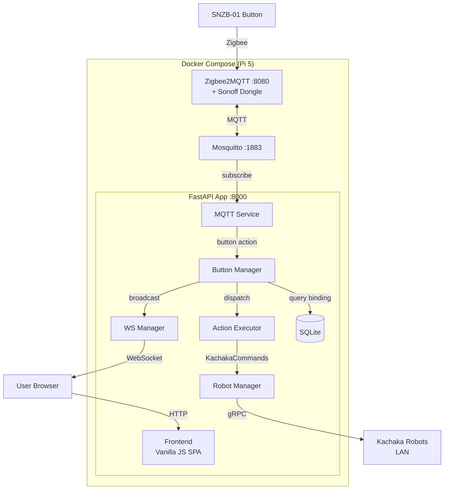
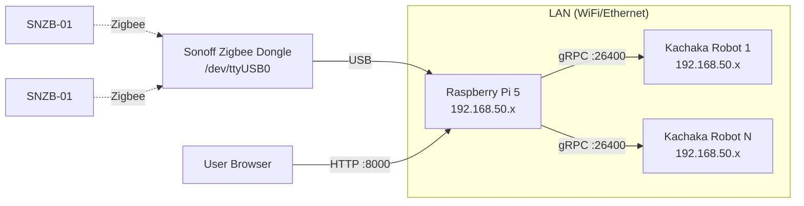
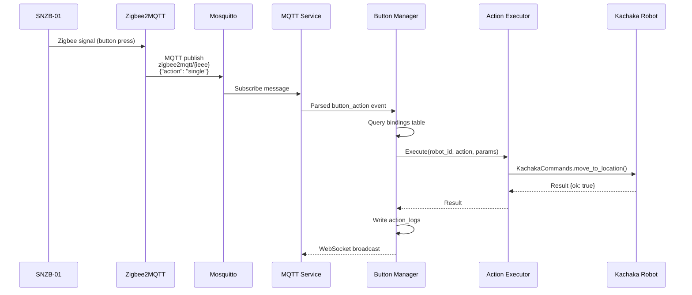
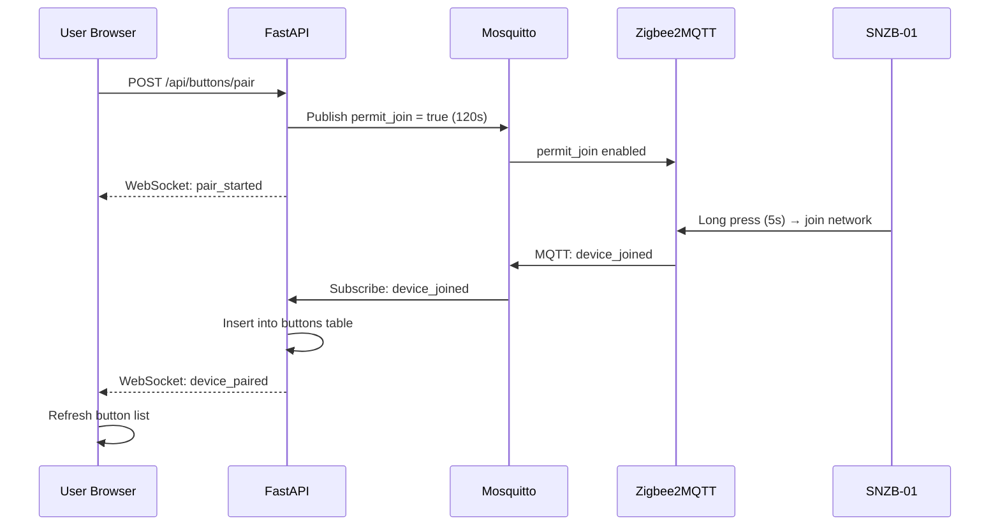
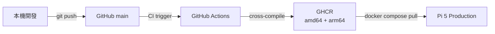

# Sigma 簡易控制介面

Raspberry Pi 5 上運行的 Zigbee 按鈕控制器，透過 Web UI 配對 SNZB-01 按鈕並綁定 Kachaka 機器人動作。按下按鈕即觸發對應的機器人指令。

## 功能

- **多機器人管理** — 新增/編輯/刪除多台 Kachaka 機器人，顯示在線狀態、電量、序號
- **Zigbee 按鈕配對** — Web UI 一鍵啟動配對模式，自動偵測 SNZB-01 設備
- **按鈕動作綁定** — 每個按鈕的 3 種觸發方式（單擊/雙擊/長按）各自綁定一個動作
- **8 種 Kachaka 動作** — 移動到位置、回充電座、語音播報、搬運/歸還貨架、對接/放下貨架、執行捷徑
- **機器人監控** — 即時地圖 + 機器人位置、前後鏡頭串流
- **執行記錄** — 完整的動作執行歷史，含錯誤代碼
- **Telegram 通知** — 設定 Bot Token + Chat ID，手動測試通知
- **RWD 響應式設計** — 桌面/手機最佳化，手機版浮動選單按鈕

## 系統架構



## 硬體需求



| 元件 | 說明 |
|------|------|
| Raspberry Pi 5 | 主控制器，運行 Docker Compose |
| Sonoff Zigbee Dongle | USB Zigbee coordinator (`/dev/ttyUSB0`) |
| SNZB-01 | Sonoff Zigbee 按鈕（單擊/雙擊/長按） |
| Kachaka Robot | 一台或多台，透過 LAN gRPC 連線 |

## 快速開始

### 前提條件

- Raspberry Pi 5（或任何 Linux arm64/amd64 機器）
- Sonoff Zigbee Dongle 已插入 USB
- Docker + Docker Compose 已安裝
- Kachaka 機器人在同一區域網路

### 首次部署

```bash
# 1. Clone
git clone https://github.com/Sigma-Snaken/pi-zigbee.git
cd pi-zigbee

# 2. 確認 Zigbee Dongle 路徑
ls /dev/ttyUSB* /dev/ttyACM*

# 3. 使用 deploy 腳本
cd deploy
chmod +x setup.sh
./setup.sh

# 4. 啟動
cd /opt/app/pi-zigbee
docker compose pull
docker compose up -d
```

### 開發環境

```bash
# Clone + 啟動開發環境
git clone https://github.com/Sigma-Snaken/pi-zigbee.git
cd pi-zigbee
docker compose up --build

# override.yml 自動套用：src/ volume mount + --reload
# 改 code 即時生效，不需重建
```

### 存取

| 服務 | URL | 說明 |
|------|-----|------|
| Web UI | `http://<PI_IP>:8000` | 主控制介面 |
| Zigbee2MQTT | `http://<PI_IP>:8080` | Zigbee 設備管理（debug 用） |

## 使用方式

### 1. 新增機器人

進入「機器人」頁面 → 點「+ 新增機器人」→ 輸入名稱和 IP → 自動連線驗證

### 2. 配對 Zigbee 按鈕

進入「按鈕」頁面 → 點「開始配對」→ 長按 SNZB-01 五秒直到 LED 閃爍 → 自動偵測並加入

### 3. 綁定動作

進入「綁定設定」頁面 → 選按鈕 → 為每個觸發方式（單擊/雙擊/長按）設定：
- 選擇機器人
- 選擇動作（位置、貨架、捷徑等從機器人自動載入）
- 點「儲存設定」

### 4. 監控機器人

進入「機器人監控」頁面 → 選擇機器人 → 查看即時地圖 + 位置 → 開啟前/後鏡頭

### 5. 設定 Telegram 通知

進入「執行記錄」頁面 → 輸入 Telegram Bot Token 和 Chat ID → 儲存 → 點「測試通知」驗證

## 專案結構

```
pi-zigbee/
├── src/
│   ├── backend/
│   │   ├── main.py                  # FastAPI + lifespan
│   │   ├── routers/
│   │   │   ├── robots.py            # CRUD /api/robots + locations/shelves/shortcuts
│   │   │   ├── buttons.py           # CRUD /api/buttons + pair
│   │   │   ├── bindings.py          # GET/PUT /api/bindings/{button_id}
│   │   │   ├── logs.py              # GET /api/logs (分頁)
│   │   │   ├── monitor.py           # /api/robots/{id}/map, /camera/{front|back}
│   │   │   ├── settings.py          # /api/system/info, /api/settings/notify
│   │   │   └── ws.py                # WebSocket /ws
│   │   ├── services/
│   │   │   ├── robot_manager.py     # 多機器人管理 (kachaka_core)
│   │   │   ├── mqtt_service.py      # aiomqtt + Zigbee2MQTT 訊息解析
│   │   │   ├── button_manager.py    # 配對 + 綁定查詢 + 動作分派
│   │   │   ├── action_executor.py   # ACTION_MAP → KachakaCommands
│   │   │   ├── ws_manager.py        # WebSocket 廣播
│   │   │   └── notifier.py          # Telegram 通知
│   │   ├── database/
│   │   │   ├── connection.py        # aiosqlite + WAL
│   │   │   └── migrations.py        # 版本化 schema
│   │   └── utils/
│   │       └── logger.py
│   └── frontend/
│       ├── index.html               # SPA 入口
│       ├── favicon.png
│       ├── css/style.css            # Vintage Command Terminal 主題
│       └── js/
│           ├── app.js               # Tab 路由 + FAB 選單 + 工具函式
│           ├── api.js               # REST API 封裝
│           ├── websocket.js         # WebSocket 自動重連
│           ├── robots.js            # 機器人管理
│           ├── buttons.js           # 按鈕配對
│           ├── bindings.js          # 綁定設定
│           ├── logs.js              # 執行記錄 + 通知設定
│           └── monitor.js           # 地圖 + 鏡頭監控
├── data/                             # Runtime (gitignored)
├── zigbee2mqtt/                      # Z2M 設定
├── mosquitto/                        # Mosquitto 設定
├── docker-compose.yml                # Dev: local build + live reload
├── docker-compose.override.yml       # Dev: volume mount
├── Dockerfile                        # Python 3.12 + uv
├── deploy/
│   ├── docker-compose.yml            # Prod: pull from GHCR
│   ├── daemon.json                   # Docker IPv4 enforcement
│   ├── setup.sh                      # 首次部署腳本
│   └── .env.example
├── .github/workflows/build.yml       # CI: cross-compile amd64+arm64 → GHCR
├── requirements.txt
└── tests/                            # 37 tests
```

## 技術棧

| 層級 | 技術 |
|------|------|
| Backend | FastAPI, Python 3.12, aiosqlite, aiomqtt |
| Robot SDK | kachaka-sdk-toolkit (`kachaka_core`) |
| Frontend | Vanilla JS SPA (無 build tool) |
| Zigbee | Zigbee2MQTT + Mosquitto |
| Database | SQLite (WAL mode) + 版本化 migration |
| Container | Docker Compose, `uv` 套件管理 |
| CI/CD | GitHub Actions → GHCR (amd64 + arm64) |

## 資料流

### 按鈕按下 → 機器人動作



### 按鈕配對流程



## 支援的動作

| 動作 | 參數 | 說明 |
|------|------|------|
| `move_to_location` | `name` (從機器人載入) | 移動到指定位置 |
| `return_home` | — | 回充電座 |
| `speak` | `text` | 語音播報 |
| `move_shelf` | `shelf`, `location` (從機器人載入) | 搬運貨架到指定位置 |
| `return_shelf` | `shelf` (從機器人載入) | 歸還貨架 |
| `dock_shelf` | — | 對接貨架 |
| `undock_shelf` | — | 放下貨架 |
| `start_shortcut` | `shortcut_id` (從機器人載入) | 執行 Kachaka 捷徑 |

## API

| Method | Endpoint | 說明 |
|--------|----------|------|
| GET | `/api/health` | 健康檢查 |
| GET | `/api/robots` | 機器人列表（含在線狀態、電量、序號） |
| POST | `/api/robots` | 新增機器人 `{name, ip}` |
| PUT | `/api/robots/{id}` | 更新機器人 |
| DELETE | `/api/robots/{id}` | 刪除機器人 |
| GET | `/api/robots/{id}/locations` | 機器人位置清單 |
| GET | `/api/robots/{id}/shelves` | 機器人貨架清單 |
| GET | `/api/robots/{id}/shortcuts` | 機器人捷徑清單 |
| GET | `/api/robots/{id}/map` | 地圖 + 機器人位置 |
| GET | `/api/robots/{id}/camera/{front\|back}` | 鏡頭影像 |
| GET | `/api/buttons` | 按鈕列表 |
| POST | `/api/buttons/pair` | 啟動配對模式 (120s) |
| POST | `/api/buttons/pair/stop` | 停止配對 |
| PUT | `/api/buttons/{id}` | 重命名按鈕 |
| DELETE | `/api/buttons/{id}` | 移除按鈕 |
| GET | `/api/bindings/{button_id}` | 按鈕綁定設定 |
| PUT | `/api/bindings/{button_id}` | 更新綁定 |
| GET | `/api/logs?page=N` | 執行記錄（分頁） |
| GET | `/api/system/info` | 系統 IP 資訊 |
| GET | `/api/settings/notify` | Telegram 通知設定 |
| PUT | `/api/settings/notify` | 更新通知設定 |
| POST | `/api/settings/notify/test` | 發送測試通知 |
| WS | `/ws` | WebSocket 即時事件 |

## 部署

### 開發 → 生產流程



### 更新生產環境

```bash
ssh sigma@<PI_IP> "cd /opt/app/pi-zigbee && docker compose pull && docker compose up -d"
```

## 測試

```bash
# 建立虛擬環境
uv venv .venv && uv pip install -r requirements.txt

# 執行所有測試
.venv/bin/pytest tests/ -v

# 37 tests covering:
# - Database migrations + constraints
# - WebSocket manager
# - Robot manager
# - Action executor (8 actions)
# - MQTT message parsing (8 scenarios)
# - Button manager (pairing + dispatch)
# - API endpoints (CRUD + bindings)
# - Integration (full button→robot flow)
```

## License

Private repository.
