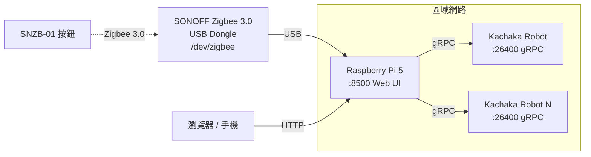
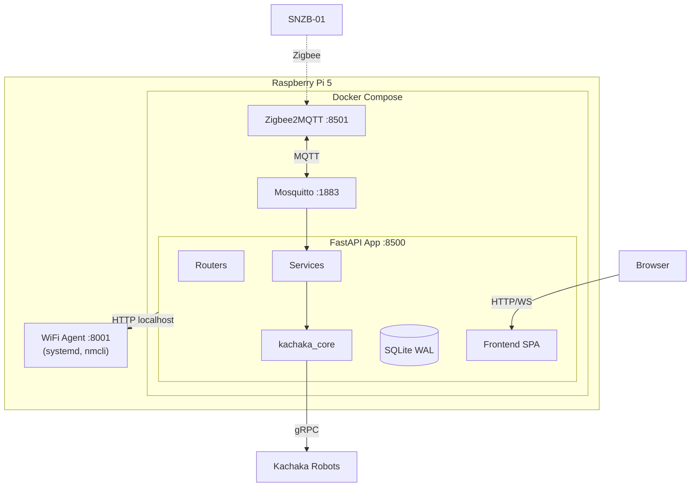
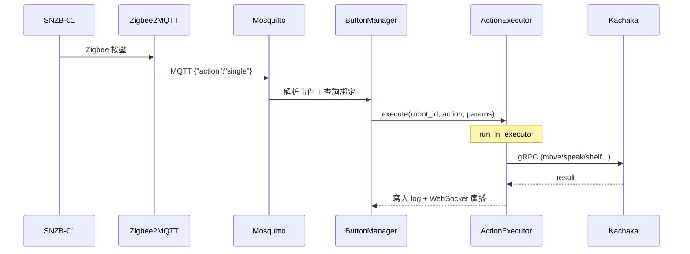
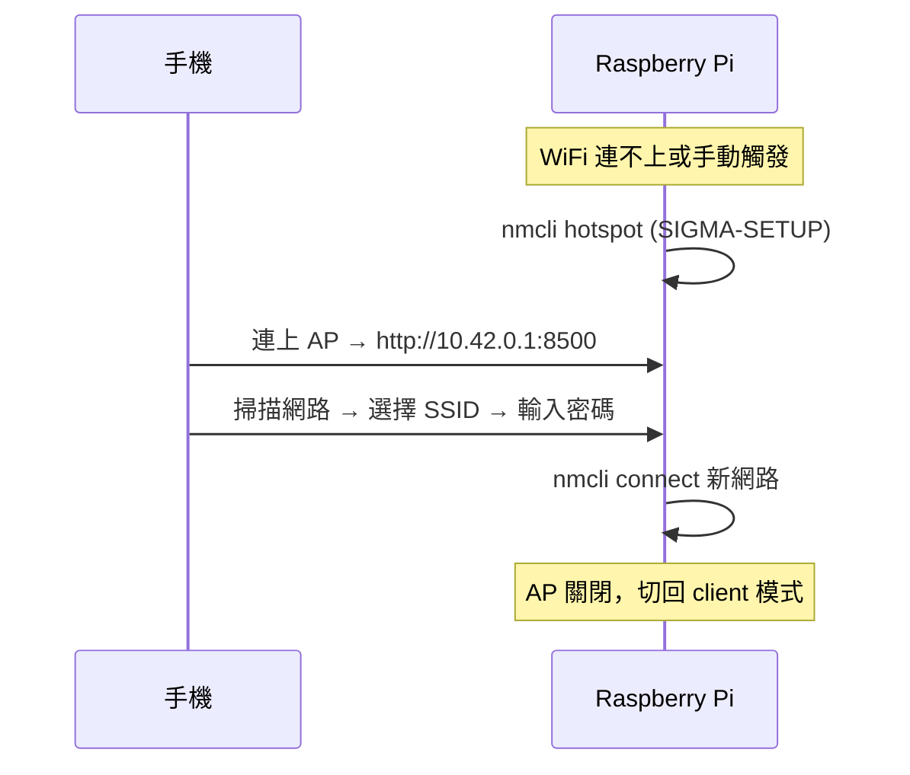

# Sigma Button Controller

[](https://github.com/Sigma-Snaken/sigma-button-controller/actions/workflows/build.yml)
[](LICENSE)

Zigbee 按鈕 → Kachaka 機器人控制器。透過 Web UI 配對 SONOFF SNZB-01 按鈕，將單擊/雙擊/長按綁定到 Kachaka 動作（移動、搬貨架、語音播報等），一鍵觸發。運行於 Raspberry Pi 5。

## 功能

- **多機器人管理** — 動態新增/移除 Kachaka，即時狀態與電量
- **Zigbee 按鈕配對** — Web UI 一鍵 permit_join，自動偵測 SNZB-01
- **三觸發綁定** — 單擊/雙擊/長按各自綁定不同動作，參數從機器人即時載入
- **11 種綁定動作** — 9 種機器人動作（移動、回充、語音、搬運/歸還/重置貨架、對接/放下、執行捷徑）+ 取消命令 + 派遣路線模板
- **多停靠點路線** — Online 模式（WiFi 全程連線）+ Offline 模式（SSH 部署腳本到 Playground，適用 WiFi 死角，IMU yaw-rate 零交叉偵測搖晃確認），支援模板、Round-Robin 派遣、確認按鈕；server 重啟可自動 rebuild、把卡半路的 online run 標為 `interrupted`
- **機器人監控** — 即時地圖 + 位置、前/後鏡頭串流 (5 FPS)、RTT 熱力圖、MQTT 連線狀態即時推播
- **WiFi 設定 + AP 配網** — 搬到新環境時，手機連 AP 即可設定 WiFi
- **命令佇列** — 按鈕觸發排隊、去重 (debounce)、可取消執行中或排隊中命令；佇列可整體停用
- **執行記錄** — 完整歷史含錯誤代碼，支援分頁
- **Telegram 通知** — 執行失敗或路線超時自動推送
- **RWD** — 桌面/平板/手機自適應，手機版 FAB 浮動選單
- **Chaos test 框架** — `tests/chaos/` 對實機注入故障（停 mosquitto / PATCH IP / 重啟 app）驗證 CORNER cases

## 硬體架構



## 軟體架構



### 部署架構

| 元件 | 部署方式 | 原因 |
|------|---------|------|
| Mosquitto | Docker | 獨立服務 |
| Zigbee2MQTT | Docker | device passthrough |
| FastAPI App | Docker | 環境隔離，GHCR pull 更新 |
| WiFi Agent | systemd (host) | 需要 nmcli，50 行 stdlib script |

### 核心設計原則

- **單 worker** — 機器人一次一個命令，多 worker 無意義且造成 state 衝突
- **非阻塞讀取** — 狀態一律從 `controller.state` / `conn.state` 讀取（記憶體，零 I/O）
- **sync gRPC 走 executor** — 寫入操作用 `run_in_executor` 避免阻塞 event loop
- **CameraStreamer** — 背景 thread 拉幀，HTTP handler 只讀 `latest_frame`

## 資料流

### 按鈕觸發 → 機器人動作



### WiFi AP 配網



## 快速開始

### 硬體需求

- Raspberry Pi 5 (或任何 Linux amd64/arm64)
- SONOFF Zigbee 3.0 USB Dongle Plus
- SONOFF SNZB-01 按鈕 (一個或多個)
- Kachaka 機器人 (同一區域網路)

### 生產部署

**1. 下載部署檔案**

```bash
curl -L https://github.com/Sigma-Snaken/sigma-button-controller/archive/refs/heads/main.tar.gz \
    | tar xz --strip=1 sigma-button-controller-main/deploy
cd deploy
```

**2. 首次設定 (Docker + udev + SSH key + systemd)**

```bash
chmod +x setup.sh && ./setup.sh
```

> 首次安裝 Docker 後，腳本會自動停止並提示重新登入。
> 請登出再登入（或 `sudo reboot`），然後再執行一次 `./setup.sh` 完成剩餘設定。
>
> 腳本會在 `~/.ssh/id_rsa` 自動產生 SSH 金鑰（給 Offline 模式部署離線路線用），並由 `docker-compose.yml` 唯讀掛載進 app 容器；
> 後續需到 Web UI「路線 → Offline 模式 → 測試」取得公鑰，貼到每台機器人 Playground 容器的 `~/.ssh/authorized_keys`。詳細步驟見 `docs/manual/operation-manual.md` §4.2。

> **Offline 模式前置：每台機器人需先安裝 `kachaka_api`**
>
> Offline 模式部署的 `route_executor.py` 會 `import kachaka_api`，但 Playground 預設**不會**自帶這個套件。
> 請用瀏覽器打開機器人的 Playground 網頁（不需要 SSH），照官方 README 的 Python 安裝步驟操作：
> 👉 [pf-robotics/kachaka-api — Python](https://github.com/pf-robotics/kachaka-api?tab=readme-ov-file#python)
> 若未安裝，派遣後機器人不會移動，原因是腳本啟動時即拋 `ModuleNotFoundError: No module named 'kachaka_api'`。

**3. 啟動所有服務 (Mosquitto + Z2M + App)**

```bash
cd /opt/app/sigma-button-controller
docker compose pull && docker compose up -d
```

**4. 啟動 WiFi agent**

```bash
sudo systemctl start sigma-wifi
```

> **Docker 網段注意**
>
> `setup.sh` 會將 Docker 內部網段限縮為 `10.255.255.0/24`（寫入 `/etc/docker/daemon.json`），
> 避免 Docker 預設佔用 `172.17~172.31` 網段導致與實體 LAN（如 `172.20.10.x`）衝突。
> 若上位網路恰好使用 `10.255.255.x` 網段，需手動修改 `daemon.json` 中的 `base` 為其他不衝突的私有網段。

> **Zigbee Dongle 注意**
>
> `setup.sh` 建立 udev rule 將 dongle 固定為 `/dev/zigbee`。預設針對 SONOFF (USB ID `10c4:ea60`)。
> 其他廠牌需修改：
> ```bash
> udevadm info -a -n /dev/ttyUSB0 | grep -E 'idVendor|idProduct'
> sudo nano /etc/udev/rules.d/99-zigbee.rules
> sudo udevadm control --reload-rules && sudo udevadm trigger
> ```

### 開發環境

```bash
git clone https://github.com/Sigma-Snaken/sigma-button-controller.git
cd sigma-button-controller
docker compose up --build
# docker-compose.override.yml 自動套用：src/ volume mount + --reload
```

### 存取服務

| 服務 | URL |
|------|-----|
| 控制介面 | `http://<IP>:8500` |
| Zigbee2MQTT | `http://<IP>:8501` |

## 技術棧

| 層級 | 技術 |
|------|------|
| 後端 | Python 3.12, FastAPI, uvicorn, aiomqtt, aiosqlite, httpx |
| 機器人 SDK | [kachaka-sdk-toolkit](https://github.com/Sigma-Snaken/kachaka-sdk-toolkit) |
| 前端 | Vanilla JS ES Modules, CSS3 |
| 資料庫 | SQLite WAL, 版本化 migration |
| MQTT | Eclipse Mosquitto 2 |
| Zigbee | Zigbee2MQTT + SONOFF Dongle |
| CI/CD | GitHub Actions → GHCR (amd64 + arm64) |

## API 端點

### 機器人

| Method | Endpoint | 說明 |
|--------|----------|------|
| GET | `/api/robots` | 列表 (online/battery/serial 從 controller.state 讀取) |
| POST | `/api/robots` | 新增 |
| PUT | `/api/robots/{id}` | 更新 |
| DELETE | `/api/robots/{id}` | 刪除 |
| GET | `/api/robots/{id}/locations` | 位置清單 |
| GET | `/api/robots/{id}/shelves` | 貨架清單 |
| GET | `/api/robots/{id}/shortcuts` | 捷徑清單 |

### 監控

| Method | Endpoint | 說明 |
|--------|----------|------|
| GET | `/api/robots/{id}/map` | 地圖 + 位置 (pose 從 controller.state) |
| GET | `/api/robots/{id}/camera/{front\|back}` | 鏡頭 (CameraStreamer latest_frame) |
| GET | `/api/robots/{id}/camera/{cam}/stream` | MJPEG multipart 串流 |
| POST | `/api/robots/{id}/camera/{cam}/start` | 啟動串流 |
| POST | `/api/robots/{id}/camera/{cam}/stop` | 停止串流 |
| GET | `/api/robots/{id}/metrics` | RTT 統計 |
| GET | `/api/robots/{id}/rtt-heatmap` | 熱力圖資料 |
| DELETE | `/api/robots/{id}/rtt-heatmap` | 清除 RTT |

### 按鈕 & 綁定

| Method | Endpoint | 說明 |
|--------|----------|------|
| GET | `/api/buttons` | 按鈕列表 |
| PUT | `/api/buttons/{id}` | 重命名 |
| DELETE | `/api/buttons/{id}` | 刪除 |
| POST | `/api/buttons/pair` | 啟動配對 (120s) |
| POST | `/api/buttons/pair/stop` | 停止配對 |
| GET | `/api/bindings/{button_id}` | 查詢綁定 |
| PUT | `/api/bindings/{button_id}` | 更新綁定 |

### 路線

| Method | Endpoint | 說明 |
|--------|----------|------|
| GET | `/api/routes/templates` | 模板列表 |
| POST | `/api/routes/templates` | 建立模板 |
| PUT | `/api/routes/templates/{id}` | 更新模板 |
| DELETE | `/api/routes/templates/{id}` | 刪除模板 |
| POST | `/api/routes/dispatch` | 派遣路線（template 或 ad-hoc） |
| POST | `/api/routes/runs/{run_id}/cancel` | 取消路線 |
| GET | `/api/routes/runs` | 進行中的路線列表 |
| GET | `/api/routes/runs/{run_id}` | 單一路線細節 |
| GET | `/api/routes/history` | 已完成 / 取消 / 失敗的歷史 |
| GET | `/api/routes/dispatcher/status` | Dispatcher round-robin 狀態 |
| POST | `/api/routes/offline/report` | Offline 模式機器人腳本回報事件 |
| POST | `/api/routes/offline/test-ssh` | 測試 SSH 連線到指定機器人 |
| GET | `/api/routes/offline/public-key` | 取得 Pi 端 SSH 公鑰 |

### 命令佇列

| Method | Endpoint | 說明 |
|--------|----------|------|
| GET | `/api/queue` | 當前佇列（依機器人分組） |
| DELETE | `/api/queue/{queue_id}` | 移除尚未執行的命令 |
| POST | `/api/queue/cancel/{robot_id}` | 取消執行中的命令 |

### WiFi

| Method | Endpoint | 說明 |
|--------|----------|------|
| GET | `/api/wifi/status` | 連線狀態 (SSID/IP/signal/mode) |
| POST | `/api/wifi/scan` | 掃描可用網路 |
| POST | `/api/wifi/connect` | 連線 WiFi |
| POST | `/api/wifi/hotspot/start` | 啟動 AP |
| POST | `/api/wifi/hotspot/stop` | 關閉 AP |
| GET | `/api/wifi/connections` | 已儲存的連線 |
| POST | `/api/wifi/autoconnect` | 設定自動連線 on/off |
| POST | `/api/wifi/connection/delete` | 移除已儲存的連線 |

### 系統 & 設定

| Method | Endpoint | 說明 |
|--------|----------|------|
| GET | `/api/health` | 健康檢查（含 `mqtt_connected`） |
| GET | `/api/system/info` | 系統 URL |
| GET / PUT | `/api/settings/notify` | Telegram 設定 |
| POST | `/api/settings/notify/test` | 測試通知 |
| GET / PUT | `/api/settings/rtt-logger` | RTT logger 開關 |
| GET / PUT | `/api/settings/queue` | 命令佇列開關 |
| GET / PUT | `/api/settings/route-mode` | 路線模式（online/offline）|
| GET / PUT | `/api/settings/pi-url` | Pi 對機器人可見的回報 URL（offline 模式用）|
| GET | `/api/logs?page=N` | 執行記錄 |
| WS | `/ws` | 即時事件（pose、shelf、route、mqtt:state ...）|

### 支援的綁定動作

| 動作 | 參數 | 執行方式 |
|------|------|----------|
| `move_to_location` | `{name}` | RobotController |
| `return_home` | — | RobotController |
| `move_shelf` | `{shelf, location}` | RobotController |
| `return_shelf` | `{shelf}` | RobotController |
| `speak` | `{text}` | KachakaCommands |
| `dock_shelf` | — | KachakaCommands |
| `undock_shelf` | — | KachakaCommands |
| `reset_shelf` | `{shelf}` | KachakaCommands（清除機器人對該架子的位姿記錄）|
| `start_shortcut` | `{shortcut_id}` | KachakaCommands |
| `cancel_command` | — | ButtonManager 直接 dispatch 取消 |
| `start_route` | `{template_id}` | RouteDispatcher 派遣模板（online 或 offline 依 Settings）|

## 資料庫

SQLite WAL, 6 版本 migration, 9 tables:

| 表 | 用途 | 版本 |
|----|------|------|
| `robots` | 機器人 (id, name, ip, enabled) | V1 |
| `buttons` | 按鈕 (ieee_addr, battery, last_seen) | V1 |
| `bindings` | 綁定 (button_id, trigger, action, params)；`UNIQUE(button_id, trigger)` | V1 |
| `action_logs` | 執行記錄 | V1 |
| `settings` | KV 設定 | V2 |
| `rtt_logs` | RTT 記錄 (robot_name, serial, x, y, theta, battery, rtt_ms, recorded_at) | V3 |
| `route_templates` | 路線模板 (stops, shelf_name, pinned_robot_id, confirm_button_id) | V4 / V5 |
| `route_runs` | 路線執行紀錄 (status, current_stop, execution_mode) | V4 / V5 / V6 |
| `route_stop_logs` | 每站時間軸 (arrived_at, confirmed_at, confirmed_by, timed_out) | V4 |

## 測試

```bash
uv venv .venv && uv pip install -r requirements.txt
.venv/bin/pytest tests/ -v
```

## 專案結構

```
sigma-button-controller/
├── src/
│   ├── backend/
│   │   ├── main.py                  # FastAPI + lifespan
│   │   ├── routers/                 # 10 個路由模組（含 routes/queue/ws）
│   │   ├── services/                # 12 個服務模組（含 route_dispatcher, offline_*, command_queue ...）
│   │   ├── database/                # connection + 6 版 migration
│   │   └── utils/
│   └── frontend/
│       ├── index.html               # SPA (7 個 Tab：機器人/路線/按鈕/動作設定/執行記錄/機器人監控/WiFi)
│       ├── css/style.css            # Amber/Teal 主題 + RWD
│       └── js/                      # 10 個 ES Modules（含 routes.js + websocket.js）
├── deploy/
│   ├── docker-compose.yml           # Mosquitto + Z2M + App
│   ├── wifi-agent.py                # WiFi 管理 (host, stdlib only)
│   ├── sigma-wifi.service           # WiFi agent systemd service
│   └── setup.sh                     # 首次部署腳本 + SSH key auto-gen
├── mosquitto/                       # Mosquitto 設定
├── zigbee2mqtt/                     # Z2M 設定
├── tests/                           # pytest（含 tests/chaos/ chaos 測試）
├── docs/manual/                     # 操作手冊 + 截圖
├── docker-compose.yml               # 開發用 (override 提供 src/ mount + --reload)
├── Dockerfile
├── .github/workflows/build.yml      # CI: GHCR (amd64 + arm64)
└── requirements.txt
```

## License

Copyright 2026 Sigma Robotics. Licensed under the [Apache License 2.0](LICENSE).
