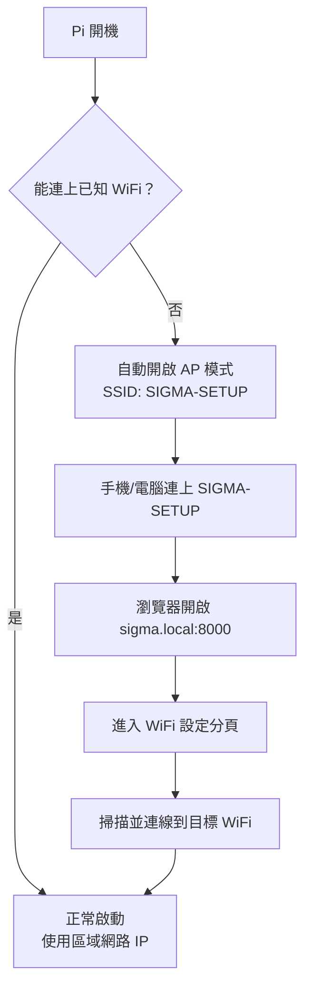
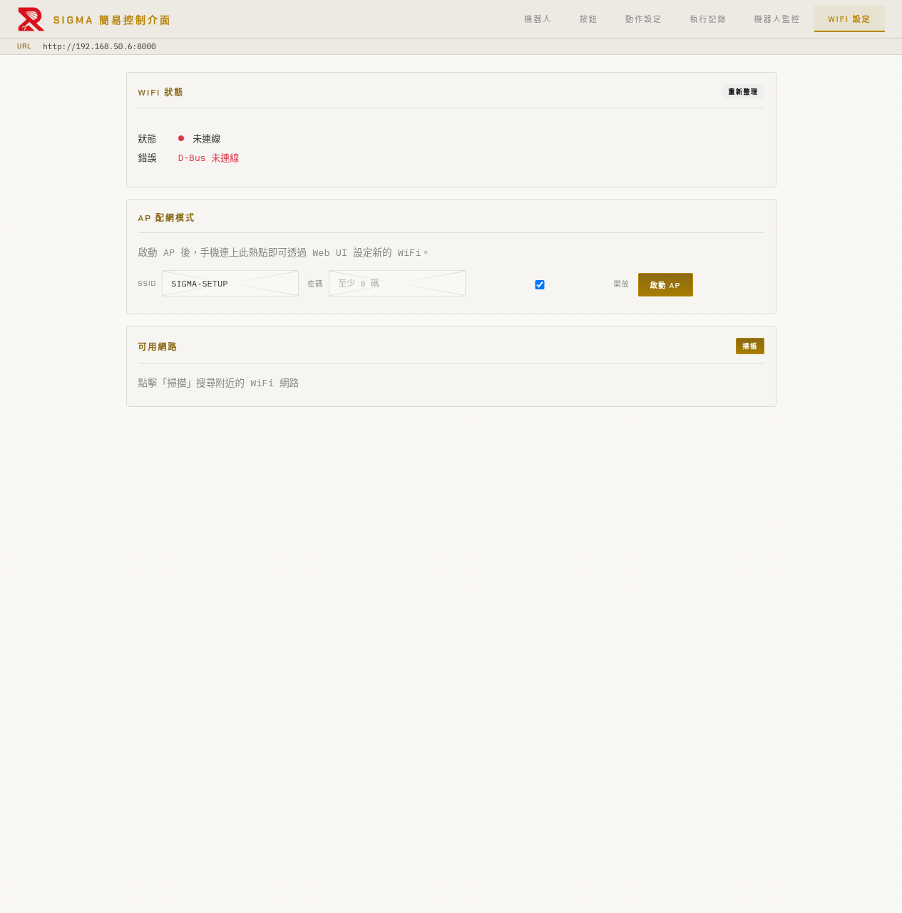
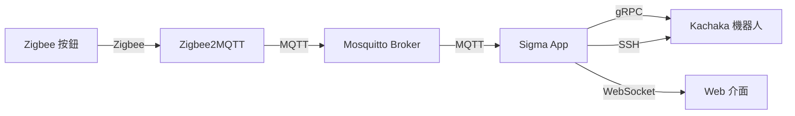
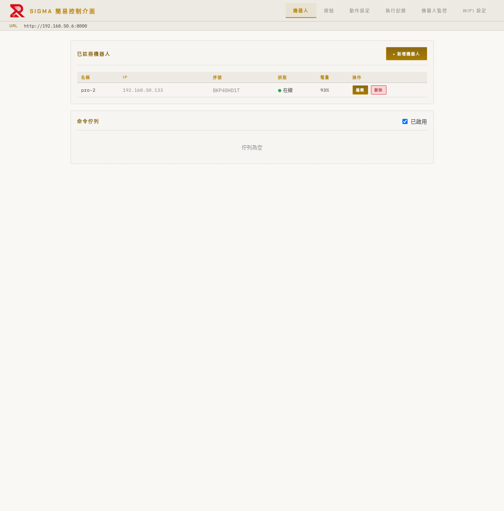
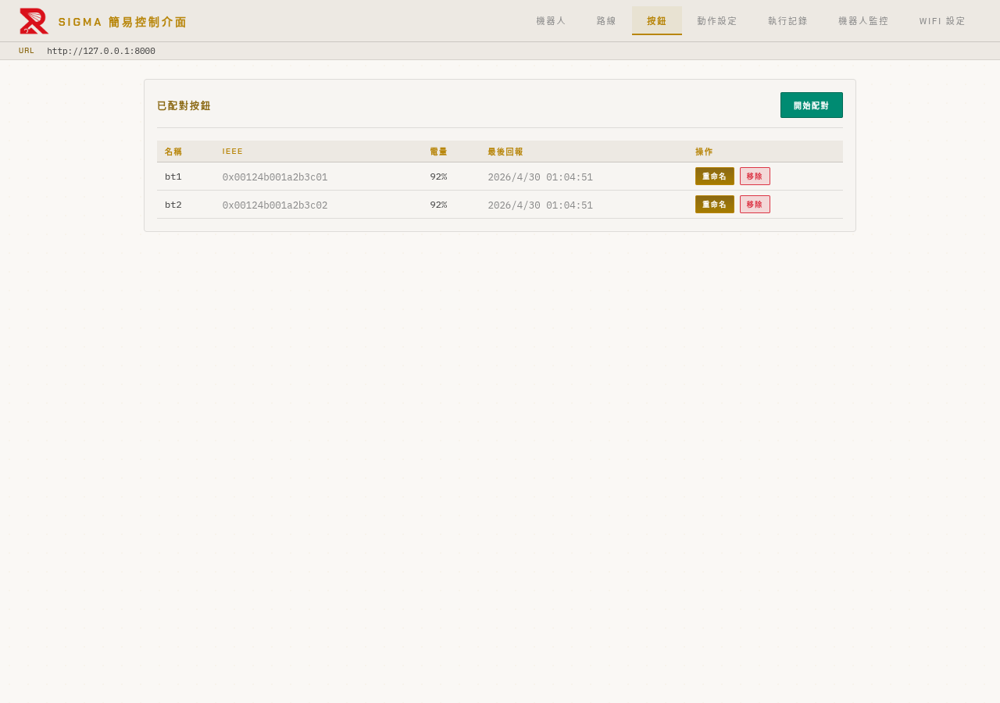
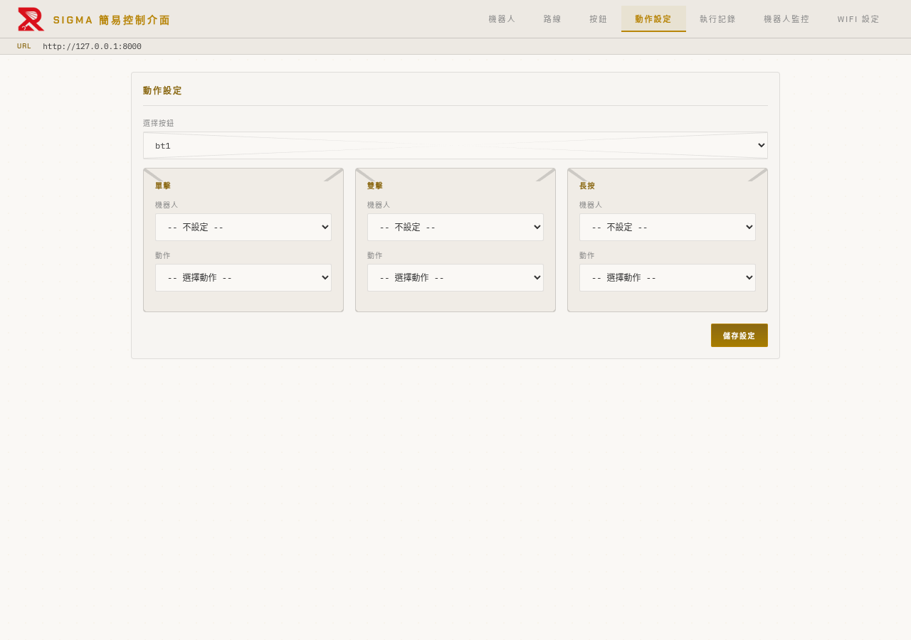
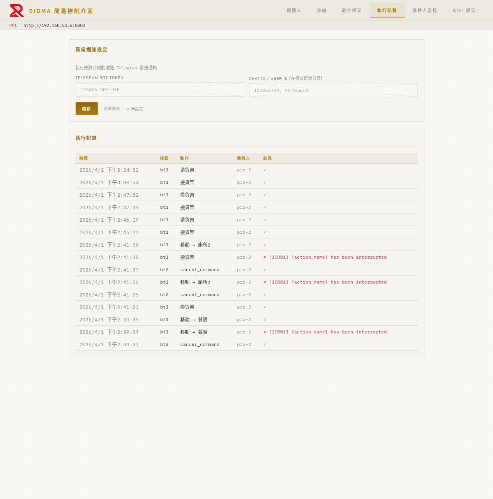
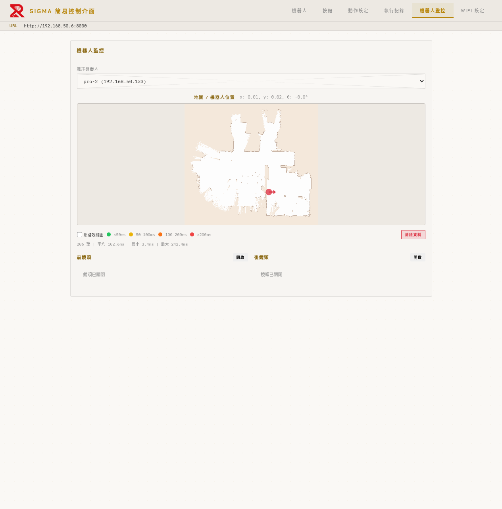

# Sigma 按鈕控制器 — 操作手冊

> **裝置**：Raspberry Pi 5
> **最後更新**：2026-04-30

---

## 目錄

1. [首次設定與網路連線](#1-首次設定與網路連線)
2. [系統概覽](#2-系統概覽)
3. [機器人管理](#3-機器人管理)
4. [路線管理（多站點配送）](#4-路線管理多站點配送)
5. [按鈕管理](#5-按鈕管理)
6. [動作設定](#6-動作設定)
7. [命令佇列](#7-命令佇列)
8. [執行記錄與通知](#8-執行記錄與通知)
9. [機器人監控](#9-機器人監控)
10. [故障排除](#10-故障排除)

---

## 1. 首次設定與網路連線

### 自動 AP 模式

Pi 開機後，如果無法連上已知的 WiFi 網路，會**自動啟動 AP 模式**（熱點），讓你透過手機或電腦進行初始設定。

| 項目 | 預設值 |
|------|--------|
| SSID | `SIGMA-SETUP` |
| 安全性 | 開放網路（無密碼） |
| mDNS 位址 | `sigma.local:8000` |

### 首次連線流程



1. 用手機或電腦搜尋 WiFi，連上 **`SIGMA-SETUP`**（開放網路）
2. 開啟瀏覽器，前往 **`http://sigma.local:8000`**
3. 切換到「**WiFi 設定**」分頁



### WiFi 設定頁面

| 區域 | 說明 |
|------|------|
| WiFi 狀態 | 顯示目前連線狀態與 IP 位址 |
| AP 配網模式 | 手動啟動/關閉 AP 熱點，可自訂 SSID 和密碼 |
| 已儲存的連線 | 列出系統記住的所有 WiFi 設定，可切換「自動連線」或刪除 |
| 可用網路 | 點擊「**掃描**」搜尋附近的 WiFi 網路，選擇後輸入密碼即可連線 |

### 連線目標 WiFi

1. 在「可用網路」區域點擊「**掃描**」
2. 從列表選擇目標 WiFi 網路
3. 輸入密碼，點擊連線
4. 連線成功後，AP 模式會自動關閉
5. Pi 取得新 IP 後，可透過 `http://sigma.local:8000` 或新 IP 位址存取

### 管理已儲存的連線

「已儲存的連線」表格列出所有曾經連線過的 WiFi。每一列可以：

- **自動連線**：勾選後 Pi 重新開機或進入服務區域時，會優先嘗試這個 WiFi
- **刪除**：移除此筆設定（不可刪除目前正在使用中的連線）
- **狀態**：顯示「使用中」或「未使用」

> **建議**：將正式部署的 WiFi 自動連線設為「開」，避免每次斷電重開都要重新配網。

### 日常存取

Pi 連上 WiFi 後，有兩種方式存取控制介面：

- **mDNS**：`http://sigma.local:8000`（推薦，IP 變動也不受影響）
- **IP 位址**：例如 `http://192.168.50.6:8000`（可在 WiFi 狀態中查看）

> **注意**：mDNS（`.local`）需要裝置與 Pi 在同一個區域網路。部分 Android 裝置可能不支援 `.local` 解析，此時請使用 IP 位址。

---

## 2. 系統概覽

Sigma 按鈕控制器是一套 Zigbee 無線按鈕與 Kachaka 機器人的整合系統。使用者透過實體按鈕（SONOFF SNZB-01P）的單擊、雙擊、長按觸發預設的機器人動作，亦可派遣多站點配送路線。



### 系統元件

| 元件 | 說明 | Port |
|------|------|------|
| Sigma App | 主應用程式（FastAPI） | 8000 |
| Mosquitto | MQTT 訊息代理 | 1883 |
| Zigbee2MQTT | Zigbee 橋接器 | 8080 |

### 介面分頁

控制介面的分頁從左至右依序為：

```
[機器人] [路線] [按鈕] [動作設定] [執行記錄] [機器人監控] [WiFi 設定]
```

---

## 3. 機器人管理

開啟控制介面後，預設顯示「**機器人**」分頁。



### 新增機器人

1. 點擊右上角「**+ 新增機器人**」
2. 輸入名稱（例如 `pro-2`）和 IP 位址（例如 `192.168.50.133`）
3. 點擊「確認」，系統會自動嘗試連線

> **重要**：機器人與 Pi 必須在同一個 WiFi 網路。如果剛完成首次設定，請確認機器人也已連上同一個 WiFi。

### 機器人資訊

| 欄位 | 說明 |
|------|------|
| 名稱 | 機器人識別名稱 |
| IP | 機器人的網路位址 |
| 序號 | 機器人硬體序號（自動偵測） |
| 狀態 | 在線（綠燈）/ 離線（紅燈） |
| 電量 | 電池百分比 |

### 編輯與刪除

- **編輯**：修改名稱或 IP 位址
- **刪除**：移除機器人（同時中斷連線）

---

## 4. 路線管理（多站點配送）

切換到「**路線**」分頁，建立並派遣多站點配送任務。系統支援兩種執行模式：

- **Online 模式**（預設）：由 Pi 即時透過 gRPC 控制機器人，每一站可由 Zigbee 按鈕確認
- **Offline 模式**：將整段路線打包為 Python 腳本，透過 SSH 部署到機器人 Playground 容器中執行；適用於 WiFi 訊號中斷區域，由 IMU 搖晃感測確認到站

### 4.1 切換執行模式

頁面頂部的「**路線模式**」切換按鈕可在 Online / Offline 之間切換。

| 模式 | 標示色 | 適用情境 |
|------|--------|----------|
| Online | 琥珀色（amber） | 全程 WiFi 訊號穩定 |
| Offline | 青色（teal） | 路徑會通過 WiFi 死角 |

切換到 Offline 模式時，下方會出現「**SSH 連線狀態**」面板。

### 4.2 Offline 模式：SSH 與回報設定

Offline 模式仰賴 Pi 與機器人之間的 SSH 通道（Port `26500`，用戶 `kachaka`）將腳本送進機器人的 Playground 容器執行。

1. **回報 IP**：在輸入框填入 Pi 對機器人可見的 URL（例如 `http://192.168.50.6:8000`），點擊「**儲存**」。腳本完成或回報事件時會 POST 到此 URL。
2. **測試 SSH**：每台機器人列旁都有「**測試**」按鈕，點擊後：
   - 若顯示 `✓ OK`，表示 Pi 已可免密碼登入該機器人
   - 若顯示 `✗ 錯誤`，下方會自動展開 SSH 公鑰，請複製貼到該機器人的 `~/.ssh/authorized_keys`

> **注意**：機器人重新開機後 Playground 容器內的腳本會中止，路線記錄會被標記為已完成（無法續跑）。建議在送出長路線前先確認電量。

### 4.3 路線模板

「**路線模板**」用於儲存常用的配送路徑，可重複派遣或綁定到實體按鈕。

#### 新增 / 編輯模板

1. 點擊「**+ 新增模板**」開啟對話框
2. 設定下列欄位：

| 欄位 | 說明 | 必填 |
|------|------|------|
| 名稱 | 模板識別名稱 | ✓ |
| 搬運貨架 | 機器人會將指定貨架帶在身上巡迴各站 | ✓ |
| 綁定機器人 | 指定固定機器人；空值則由系統自動派遣（Round-Robin） | |
| 確認按鈕 | 到站後等待哪顆按鈕按下放行；空值則僅靠超時自動前往下一站 | |
| 預設超時 | 每站等待秒數（預設 120 秒） | |
| 停靠站 | 點擊位置按鈕加入；可拖拉重新排序 | ✓（至少一站） |

3. 點擊「**儲存**」

#### 操作

每個模板列右側有三個按鈕：

| 按鈕 | 說明 |
|------|------|
| **出發** | 立即依模板派遣一筆路線 |
| **編輯** | 修改名稱、停靠站、貨架等 |
| **刪除** | 移除模板（不影響歷史記錄） |

### 4.4 快速派遣

不想存模板、只跑一次的路線，可使用「**快速派遣**」：

1. 在「停靠站」區域點擊位置按鈕（4 欄網格）選擇要去的位置
2. 已選擇的位置會以青色 chip 出現在下方，可拖拉調整順序
3. 設定搬運貨架、超時、確認按鈕、指定機器人
4. 點擊「**立即出發**」

### 4.5 執行中路線

派遣後，頁面下方會出現「**執行中路線**」卡片：

| 元素 | 說明 |
|------|------|
| 機器人名稱 | 顯示執行此路線的機器人；Offline 模式會加上「**離線執行中**」徽章（青色） |
| 進度條 | 涵蓋總共 `停靠站數 + 2` 段（取貨架 + 巡迴 + 歸還貨架/回家） |
| 站點 icon | ○ 未到 / ● 進行中 / ✓ 完成 |
| 倒數 | 顯示目前停靠站剩餘秒數（每秒更新） |
| 最後回報 | （Offline 模式）顯示最近一次從機器人收到的事件時間 |
| **取消** | 中止整段路線；Online 模式會立即停止機器人，Offline 模式會將狀態標為已取消（腳本仍會把貨架歸還並回家） |

### 4.6 路線記錄

頁面最下方「**路線記錄**」表格列出所有已結束的路線（完成、取消、失敗），依結束時間倒序排列。

| 欄位 | 說明 |
|------|------|
| 機器人 | 執行的機器人 |
| 停靠站數 | 該路線的站點數 |
| 狀態 | 完成（綠）/ 取消（橙）/ 失敗（紅）/ 離線執行中（青） |
| 開始時間 | 派遣後實際開始的時間 |
| 結束時間 | 完成、取消或失敗的時間 |

點擊「**詳情**」可看每一站的到達時間、確認時間（含確認來源 — 按鈕 IEEE 或 `imu_shake`）、離開時間、是否超時。

### 4.7 與按鈕綁定

可在「動作設定」分頁將某顆按鈕的單擊/雙擊/長按綁定為「執行路線」動作（見 [§6](#6-動作設定) ）。Offline 模式下按下實體按鈕時，系統會以該模板的設定派遣路線並透過 SSH 部署腳本。

---

## 5. 按鈕管理

切換到「**按鈕**」分頁，管理已配對的 Zigbee 按鈕。



### 配對新按鈕

1. 點擊「**開始配對**」，系統進入配對模式（120 秒倒數）
2. **長按** SNZB-01P 按鈕約 5 秒，直到 LED 開始閃爍
3. 配對成功後，新按鈕會自動出現在列表中
4. 配對完成後可點擊「停止配對」提前結束

### 按鈕資訊

| 欄位 | 說明 |
|------|------|
| 名稱 | 按鈕名稱（可自訂） |
| IEEE | 按鈕的唯一硬體位址 |
| 電量 | 按鈕電池百分比 |
| 最後回報 | 上次按下按鈕的時間（即時更新） |

### 重命名與移除

- **重命名**：點擊「重命名」，輸入新名稱
- **移除**：點擊「移除」，刪除按鈕（同時刪除相關的動作設定）

> **即時回饋**：按下實體按鈕時，對應列會閃爍淡青色並即時更新「最後回報」時間。

> **路線確認優先**：若有路線正在等待按鈕確認，按下任一按鈕會優先解除該路線的等待狀態，本次按鍵不會觸發綁定動作。

---

## 6. 動作設定

切換到「**動作設定**」分頁，將按鈕的觸發方式綁定到機器人動作。



### 設定流程

1. 從上方下拉選單選擇要設定的按鈕
2. 每個按鈕有三種觸發方式：**單擊**、**雙擊**、**長按**
3. 每種觸發方式可以獨立設定：
   - **機器人**：選擇要控制的機器人
   - **動作**：選擇要執行的動作
   - **參數**：依動作類型填入額外參數
4. 設定完成後點擊「**儲存設定**」

### 可用動作

| 動作 | 說明 | 需要參數 |
|------|------|----------|
| 移動到位置 | 機器人移動到指定地點 | 位置名稱 |
| 回充電座 | 機器人返回充電座 | 無 |
| 語音播報 | 機器人播放語音 | 文字內容 |
| 搬運貨架 | 搬運指定貨架到目標位置 | 貨架、目標位置 |
| 歸還貨架 | 將貨架送回原位 | 貨架（可選） |
| 對接貨架 | 對接最近的貨架 | 無 |
| 放下貨架 | 放下目前搬運的貨架 | 無 |
| 執行捷徑 | 執行機器人預設的捷徑 | 捷徑名稱 |
| **執行路線** | 派遣一條已建立的路線模板 | 路線模板 |
| 取消命令 | 取消機器人正在執行的命令 | 無 |

### 範例設定

以 `bt1` 按鈕為例：
- **單擊** → 搬運貨架 `s1` 到 `倉庫`
- **雙擊** → 移動到 `廁所2`
- **長按** → 執行路線「早班配送」

> **執行路線小提醒**：將「執行路線」綁到按鈕後，按一下就能派遣整條多站點任務。若該模板的「綁定機器人」欄為空，會由系統依 Round-Robin 自動挑選空閒機器人。

---

## 7. 命令佇列

命令佇列位於「**機器人**」分頁下方，用於管理待執行的機器人命令。


### 佇列功能

當機器人正在執行命令時，後續的按鈕觸發會進入佇列排隊，依序執行。

| 功能 | 說明 |
|------|------|
| 啟用/停用 | 右上角勾選框，停用後機器人忙碌時會拒絕新命令 |
| 佇列顯示 | 依機器人分組，顯示每個命令的狀態、動作、排隊時間 |
| 取消 | 取消正在執行的命令（機器人會停止移動） |
| 刪除 | 從佇列中移除尚未執行的命令 |

### 命令狀態

| 狀態 | 圖示 | 說明 |
|------|------|------|
| 執行中 | ● 執行中（綠色） | 機器人正在執行此命令 |
| 等待中 | ○ 等待中（灰色） | 排隊等候執行 |

### 防重複（Debounce）

系統會自動防止重複命令：
- 如果佇列中最後一筆命令與新命令相同，新命令會被忽略
- 如果正在執行的命令與新命令相同（佇列為空時），新命令也會被忽略
- 中間有其他命令間隔的重複則允許

### 佇列停用時的行為

關閉佇列後：
- 機器人閒置 → 直接執行命令
- 機器人忙碌 → 拒絕新命令（不排隊）

> **路線與佇列**：路線（多站點配送）有獨立的派遣器（Round-Robin），不走命令佇列。若要查看路線執行進度，請到「路線」分頁。

---

## 8. 執行記錄與通知

切換到「**執行記錄**」分頁，查看所有命令執行歷史和設定異常通知。



### 執行記錄

表格依時間倒序顯示每次命令執行的結果：

| 欄位 | 說明 |
|------|------|
| 時間 | 命令執行的時間 |
| 按鈕 | 觸發的按鈕名稱 |
| 動作 | 執行的動作（含參數） |
| 機器人 | 執行動作的機器人 |
| 結果 | ✓ 成功 / ✗ 失敗（附錯誤訊息） |

常見錯誤碼：
- `[10001] {action_name} has been interrupted` — 命令被取消（例如按了取消按鈕）

### 異常通知設定（Telegram）

設定 Telegram 通知，在命令執行失敗或路線停靠站超時時自動發送訊息：

1. 填入 **Telegram Bot Token**（從 @BotFather 取得）
2. 填入 **Chat ID / User ID**（多個以逗號分隔）
3. 點擊「**儲存**」
4. 點擊「**測試通知**」驗證設定是否正確

> **路線通知**：當路線中某個停靠站等候到超時仍無人按確認鈕，系統會自動推送 Telegram 訊息（內容含路線 ID、停靠站序號、機器人 ID）。

---

## 9. 機器人監控

切換到「**機器人監控**」分頁，即時監控機器人狀態。



### 功能說明

| 功能 | 說明 |
|------|------|
| 地圖顯示 | 顯示機器人所在樓層地圖，紅點標示目前位置 |
| 位置座標 | 即時顯示 x, y 座標和角度 |
| 網路效能圖 | 勾選後在地圖上疊加 RTT 熱力圖（綠 < 50ms、黃 50-100ms、橙 100-200ms、紅 > 200ms） |
| 前鏡頭 | 開啟機器人前方攝影機即時串流 |
| 後鏡頭 | 開啟機器人後方攝影機即時串流 |
| 清除資料 | 清除 RTT 熱力圖歷史資料 |

### 使用方式

1. 從下拉選單選擇要監控的機器人
2. 地圖和位置會即時更新（每秒刷新）
3. 需要看攝影機畫面時，點擊「**開啟**」按鈕

> **挑選 Offline 路徑的好幫手**：在 RTT 熱力圖上找出紅 / 橙色區域，這些是 WiFi 較弱的位置；若路線會穿越這些區域，建議切換到 Offline 模式執行。

---

## 10. 故障排除

### 無法連上控制介面

1. 確認手機/電腦與 Pi 在同一個 WiFi 網路
2. 嘗試 `http://sigma.local:8000`（mDNS）
3. 如果 mDNS 無法使用（部分 Android），透過路由器查找 Pi 的 IP 位址
4. 如果 Pi 無法連上任何 WiFi，它會自動進入 AP 模式（SSID: `SIGMA-SETUP`）

### 按鈕按下去沒反應

1. 確認「按鈕」分頁中的「最後回報」是否更新 — 如果沒更新，表示 Zigbee 訊號未收到
2. 確認 Zigbee2MQTT 是否正常運行：`http://sigma.local:8080`
3. 確認「動作設定」中已設定該按鈕的觸發動作
4. 若該按鈕被指定為路線的「確認按鈕」，且當下有路線在等候，按鍵會優先用於確認，本次不執行綁定動作
5. 查看「執行記錄」確認是否有錯誤

### 機器人顯示離線

1. 確認機器人電源已開啟
2. 確認機器人與 Pi 在同一個 WiFi 網路
3. 嘗試在「機器人」分頁編輯該機器人，確認 IP 正確
4. 刪除後重新新增機器人

### 路線無法派遣（Offline 模式）

| 錯誤訊息 | 處理方式 |
|---------|----------|
| SSH 測試 ✗ Authentication failed | 將「路線」分頁顯示的 SSH 公鑰加入機器人 Playground 容器的 `~/.ssh/authorized_keys` |
| SSH 測試 ✗ Connection refused / timeout | 確認機器人 IP 正確、機器人已開機，以及與 Pi 在同一網段 |
| Process did not start after deploy | 機器人 Playground 容器被卡住；請重新啟動機器人後再試 |
| 派遣後一直「離線執行中」 | 檢查「回報 IP」是否填寫正確（必須是 Pi 對機器人可見的 URL） |

### 命令執行失敗

| 錯誤碼 | 說明 | 處理方式 |
|--------|------|----------|
| 10001 | 命令被中斷 | 有其他命令取消了正在執行的動作，正常情況 |
| 10253 | 找不到目的地 | 確認機器人地圖中有該位置名稱 |
| TIMEOUT | 命令超時 | 檢查機器人是否卡住或路徑被阻擋 |
| Robot busy | 機器人忙碌 | 佇列已停用且機器人正在執行，等待完成或啟用佇列 |

### 重啟裝置

大多數問題都可以透過**關機重開**解決。直接拔除 Pi 的電源，等待數秒後重新插上即可。

> **注意**：重啟後所有佇列中的待執行命令會被清除（佇列僅存在於記憶體中，不會寫入硬碟）。已完成的執行記錄、按鈕配對、動作設定、路線模板等資料不受影響。
> **Offline 路線重啟特例**：Pi 重啟時若有處於「離線執行中」狀態的路線，會被自動標記為「已完成」（因為無法重新接管 SSH 連線中的腳本），但機器人本身仍會把腳本跑完並嘗試回報。
