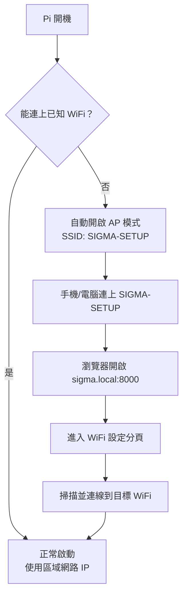
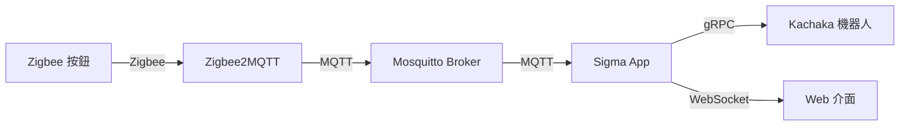

# Sigma 按鈕控制器 — 操作手冊

> **裝置**：Raspberry Pi 5
> **最後更新**：2026-04-01

---

## 目錄

1. [首次設定與網路連線](#1-首次設定與網路連線)
2. [系統概覽](#2-系統概覽)
3. [機器人管理](#3-機器人管理)
4. [按鈕管理](#4-按鈕管理)
5. [動作設定](#5-動作設定)
6. [命令佇列](#6-命令佇列)
7. [執行記錄與通知](#7-執行記錄與通知)
8. [機器人監控](#8-機器人監控)
9. [故障排除](#9-故障排除)

---

## 1. 首次設定與網路連線

### 自動 AP 模式

Pi 開機後，如果無法連上已知的 WiFi 網路，會**自動啟動 AP 模式**（熱點），讓你透過手機或電腦進行初始設定。

| 項目 | 預設值 |
|------|--------|
| SSID | `SIGMA-SETUP` |
| 安全性 | 開放網路（無密碼） |
| mDNS 位址 | `sigma.local:8000` |

### 首次連線流程

1. 用手機或電腦搜尋 WiFi，連上 **`SIGMA-SETUP`**（開放網路）
2. 開啟瀏覽器，前往 **`http://sigma.local:8000`**
3. 切換到「**WiFi 設定**」分頁

### WiFi 設定頁面

| 區域 | 說明 |
|------|------|
| WiFi 狀態 | 顯示目前連線狀態與 IP 位址 |
| AP 配網模式 | 手動啟動/關閉 AP 熱點，可自訂 SSID 和密碼 |
| 可用網路 | 點擊「**掃描**」搜尋附近的 WiFi 網路，選擇後輸入密碼即可連線 |

### 連線目標 WiFi

1. 在「可用網路」區域點擊「**掃描**」
2. 從列表選擇目標 WiFi 網路
3. 輸入密碼，點擊連線
4. 連線成功後，AP 模式會自動關閉
5. Pi 取得新 IP 後，可透過 `http://sigma.local:8000` 或新 IP 位址存取

### 日常存取

Pi 連上 WiFi 後，有兩種方式存取控制介面：

- **mDNS**：`http://sigma.local:8000`（推薦，IP 變動也不受影響）
- **IP 位址**：例如 `http://192.168.50.6:8000`（可在 WiFi 狀態中查看）

> **注意**：mDNS（`.local`）需要裝置與 Pi 在同一個區域網路。部分 Android 裝置可能不支援 `.local` 解析，此時請使用 IP 位址。

---

## 2. 系統概覽

Sigma 按鈕控制器是一套 Zigbee 無線按鈕與 Kachaka 機器人的整合系統。使用者透過實體按鈕（SONOFF SNZB-01P）的單擊、雙擊、長按觸發預設的機器人動作。

### 系統元件

| 元件 | 說明 | Port |
|------|------|------|
| Sigma App | 主應用程式（FastAPI） | 8000 |
| Mosquitto | MQTT 訊息代理 | 1883 |
| Zigbee2MQTT | Zigbee 橋接器 | 8080 |

---

## 3. 機器人管理

開啟控制介面後，預設顯示「**機器人**」分頁。

### 新增機器人

1. 點擊右上角「**+ 新增機器人**」
2. 輸入名稱（例如 `pro-2`）和 IP 位址（例如 `192.168.50.133`）
3. 點擊「確認」，系統會自動嘗試連線

> **重要**：機器人與 Pi 必須在同一個 WiFi 網路。如果剛完成首次設定，請確認機器人也已連上同一個 WiFi。

### 機器人資訊

| 欄位 | 說明 |
|------|------|
| 名稱 | 機器人識別名稱 |
| IP | 機器人的網路位址 |
| 序號 | 機器人硬體序號（自動偵測） |
| 狀態 | 在線（綠燈）/ 離線（紅燈） |
| 電量 | 電池百分比 |

### 編輯與刪除

- **編輯**：修改名稱或 IP 位址
- **刪除**：移除機器人（同時中斷連線）

---

## 4. 按鈕管理

切換到「**按鈕**」分頁，管理已配對的 Zigbee 按鈕。

### 配對新按鈕

1. 點擊「**開始配對**」，系統進入配對模式（120 秒倒數）
2. **長按** SNZB-01P 按鈕約 5 秒，直到 LED 開始閃爍
3. 配對成功後，新按鈕會自動出現在列表中
4. 配對完成後可點擊「停止配對」提前結束

### 按鈕資訊

| 欄位 | 說明 |
|------|------|
| 名稱 | 按鈕名稱（可自訂） |
| IEEE | 按鈕的唯一硬體位址 |
| 電量 | 按鈕電池百分比 |
| 最後回報 | 上次按下按鈕的時間（即時更新） |

### 重命名與移除

- **重命名**：點擊「重命名」，輸入新名稱
- **移除**：點擊「移除」，刪除按鈕（同時刪除相關的動作設定）

> **即時回饋**：按下實體按鈕時，對應列會閃爍淡青色並即時更新「最後回報」時間。

---

## 5. 動作設定

切換到「**動作設定**」分頁，將按鈕的觸發方式綁定到機器人動作。

### 設定流程

1. 從上方下拉選單選擇要設定的按鈕
2. 每個按鈕有三種觸發方式：**單擊**、**雙擊**、**長按**
3. 每種觸發方式可以獨立設定：
   - **機器人**：選擇要控制的機器人
   - **動作**：選擇要執行的動作
   - **參數**：依動作類型填入額外參數
4. 設定完成後點擊「**儲存設定**」

### 可用動作

| 動作 | 說明 | 需要參數 |
|------|------|----------|
| 移動到位置 | 機器人移動到指定地點 | 位置名稱 |
| 回充電座 | 機器人返回充電座 | 無 |
| 語音播報 | 機器人播放語音 | 文字內容 |
| 搬運貨架 | 搬運指定貨架到目標位置 | 貨架、目標位置 |
| 歸還貨架 | 將貨架送回原位 | 貨架（可選） |
| 對接貨架 | 對接最近的貨架 | 無 |
| 放下貨架 | 放下目前搬運的貨架 | 無 |
| 執行捷徑 | 執行機器人預設的捷徑 | 捷徑名稱 |
| 取消命令 | 取消機器人正在執行的命令 | 無 |

### 範例設定

以 `bt1` 按鈕為例：
- **單擊** → 搬運貨架 `s1` 到 `倉庫`
- **雙擊** → 移動到 `廁所2`
- **長按** → 歸還貨架

---

## 6. 命令佇列

命令佇列位於「**機器人**」分頁下方，用於管理待執行的機器人命令。

### 佇列功能

當機器人正在執行命令時，後續的按鈕觸發會進入佇列排隊，依序執行。

| 功能 | 說明 |
|------|------|
| 啟用/停用 | 右上角勾選框，停用後機器人忙碌時會拒絕新命令 |
| 佇列顯示 | 依機器人分組，顯示每個命令的狀態、動作、排隊時間 |
| 取消 | 取消正在執行的命令（機器人會停止移動） |
| 刪除 | 從佇列中移除尚未執行的命令 |

### 命令狀態

| 狀態 | 圖示 | 說明 |
|------|------|------|
| 執行中 | ● 執行中（綠色） | 機器人正在執行此命令 |
| 等待中 | ○ 等待中（灰色） | 排隊等候執行 |

### 防重複（Debounce）

系統會自動防止重複命令：
- 如果佇列中最後一筆命令與新命令相同，新命令會被忽略
- 如果正在執行的命令與新命令相同（佇列為空時），新命令也會被忽略
- 中間有其他命令間隔的重複則允許

### 佇列停用時的行為

關閉佇列後：
- 機器人閒置 → 直接執行命令
- 機器人忙碌 → 拒絕新命令（不排隊）

---

## 7. 執行記錄與通知

切換到「**執行記錄**」分頁，查看所有命令執行歷史和設定異常通知。

### 執行記錄

表格依時間倒序顯示每次命令執行的結果：

| 欄位 | 說明 |
|------|------|
| 時間 | 命令執行的時間 |
| 按鈕 | 觸發的按鈕名稱 |
| 動作 | 執行的動作（含參數） |
| 機器人 | 執行動作的機器人 |
| 結果 | ✓ 成功 / ✗ 失敗（附錯誤訊息） |

常見錯誤碼：
- `[10001] {action_name} has been interrupted` — 命令被取消（例如按了取消按鈕）

### 異常通知設定（Telegram）

設定 Telegram 通知，在命令執行失敗時自動發送訊息：

1. 填入 **Telegram Bot Token**（從 @BotFather 取得）
2. 填入 **Chat ID / User ID**（多個以逗號分隔）
3. 點擊「**儲存**」
4. 點擊「**測試通知**」驗證設定是否正確

---

## 8. 機器人監控

切換到「**機器人監控**」分頁，即時監控機器人狀態。

### 功能說明

| 功能 | 說明 |
|------|------|
| 地圖顯示 | 顯示機器人所在樓層地圖，紅點標示目前位置 |
| 位置座標 | 即時顯示 x, y 座標和角度 |
| 網路效能圖 | 勾選後在地圖上疊加 RTT 熱力圖（綠 < 50ms、黃 50-100ms、橙 100-200ms、紅 > 200ms） |
| 前鏡頭 | 開啟機器人前方攝影機即時串流 |
| 後鏡頭 | 開啟機器人後方攝影機即時串流 |
| 清除資料 | 清除 RTT 熱力圖歷史資料 |

### 使用方式

1. 從下拉選單選擇要監控的機器人
2. 地圖和位置會即時更新（每秒刷新）
3. 需要看攝影機畫面時，點擊「**開啟**」按鈕

---

## 9. 故障排除

### 無法連上控制介面

1. 確認手機/電腦與 Pi 在同一個 WiFi 網路
2. 嘗試 `http://sigma.local:8000`（mDNS）
3. 如果 mDNS 無法使用（部分 Android），透過路由器查找 Pi 的 IP 位址
4. 如果 Pi 無法連上任何 WiFi，它會自動進入 AP 模式（SSID: `SIGMA-SETUP`）

### 按鈕按下去沒反應

1. 確認「按鈕」分頁中的「最後回報」是否更新 — 如果沒更新，表示 Zigbee 訊號未收到
2. 確認 Zigbee2MQTT 是否正常運行：`http://sigma.local:8080`
3. 確認「動作設定」中已設定該按鈕的觸發動作
4. 查看「執行記錄」確認是否有錯誤

### 機器人顯示離線

1. 確認機器人電源已開啟
2. 確認機器人與 Pi 在同一個 WiFi 網路
3. 嘗試在「機器人」分頁編輯該機器人，確認 IP 正確
4. 刪除後重新新增機器人

### 命令執行失敗

| 錯誤碼 | 說明 | 處理方式 |
|--------|------|----------|
| 10001 | 命令被中斷 | 有其他命令取消了正在執行的動作，正常情況 |
| 10253 | 找不到目的地 | 確認機器人地圖中有該位置名稱 |
| TIMEOUT | 命令超時 | 檢查機器人是否卡住或路徑被阻擋 |
| Robot busy | 機器人忙碌 | 佇列已停用且機器人正在執行，等待完成或啟用佇列 |

### 重啟裝置

大多數問題都可以透過**關機重開**解決。直接拔除 Pi 的電源，等待數秒後重新插上即可。

> **注意**：重啟後所有佇列中的待執行命令會被清除（佇列僅存在於記憶體中，不會寫入硬碟）。已完成的執行記錄、按鈕配對、動作設定等資料不受影響。
