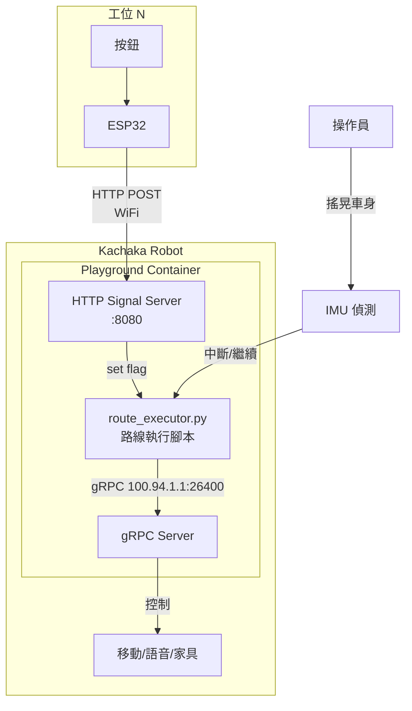
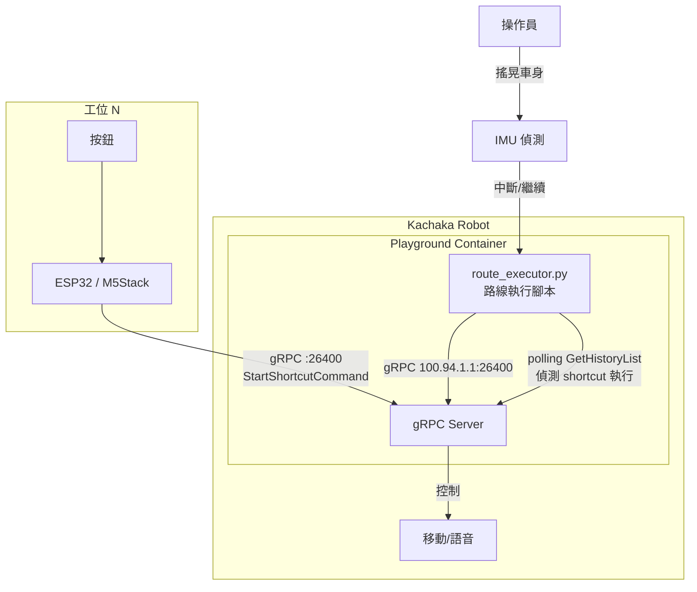

# Phase 2: Kachaka 離線自主路線執行可行性調查

> **Project**: sigma-button-controller
> **Date**: 2026-04-08
> **Status**: POC Complete — See Simulation Results

## Executive Summary

Phase 2 目標：讓 Kachaka 機器人在工廠 WiFi 中斷時，仍能自主完成整條多站路線。調查結論如下：

| 調查項目 | 結論 | 信心度 |
|----------|------|--------|
| Jupyter Notebook API（離線腳本執行） | **已驗證可行** — Dry-run 通過 | 高 |
| 搖晃偵測（Shake Detection） | **已驗證可行** — IMU 方案，Live test 通過 | 高 |
| Station 裝置 → 機器人直接通訊 | **可行** — 需用 gRPC :26400（HTTP port 不通） | 高 |

---

## 1. Kachaka Jupyter Notebook API

### 1.1 調查結果

Kachaka 內建完整的 JupyterLab 環境，具備以下能力：

| 項目 | 詳情 |
|------|------|
| **存取方式** | `http://<robot-ip>:26501/` |
| **預設密碼** | `kachaka` |
| **SSH 存取** | `ssh -p 26500 -i <private_key> kachaka@<robot-ip>` |
| **內部 gRPC 位址** | `100.94.1.1:26400`（Playground 容器內部） |
| **自動啟動腳本** | `/home/kachaka/kachaka_startup.sh` |
| **執行環境** | Docker 容器（sandbox），非 host OS |

### 1.2 Jupyter REST API

JupyterLab 基於標準 Jupyter Server，REST API 端點應可用：

| 端點 | 用途 |
|------|------|
| `GET /api/contents/<path>` | 瀏覽/讀取檔案 |
| `PUT /api/contents/<path>` | 上傳/建立檔案 |
| `POST /api/kernels` | 建立新 kernel |
| `POST /api/kernels/<id>/execute` | 執行程式碼 |

認證方式：Token-based（`Authorization: token <token>`）或 password（預設 `kachaka`）。

> **注意**：Jupyter 啟動參數為 `jupyter-lab --port=26501 --ip='0.0.0.0'`，預設無 TLS。在工廠區域網路中，安全性風險可接受，但須避免暴露到外部網路。

### 1.3 腳本內控制本機

在 Playground 容器內，可直接使用 kachaka-api SDK：

```python
import kachaka_api
client = kachaka_api.KachakaApiClient("100.94.1.1:26400")
client.move_to_location("Station_A")
```

- 使用 `100.94.1.1:26400`（非 `localhost`），這是容器到 host 的固定路由
- 不需要 WiFi — gRPC 走容器內部網路，即使外部 WiFi 中斷也能通訊

### 1.4 自動啟動機制

`/home/kachaka/kachaka_startup.sh` 在機器人開機時自動執行：

```bash
#!/bin/bash
jupyter-lab --port=26501 --ip='0.0.0.0' &
# 加入自訂路線腳本
python3 -u /home/kachaka/route_executor.py 100.94.1.1:26400 &
```

日誌輸出至 `/tmp/kachaka_startup.log`，建議使用 `python3 -u` 避免 buffer 延遲。

### 1.5 結論：可行

離線路線執行的核心方案：

1. 透過 Jupyter REST API 或 SSH 上傳 Python 路線腳本到 `/home/kachaka/`
2. 腳本使用 `100.94.1.1:26400` 內部路由控制機器人
3. 可選擇：手動從 JupyterLab 執行，或寫入 `kachaka_startup.sh` 開機自動執行
4. WiFi 中斷不影響腳本執行（gRPC 走容器內網）

---

## 2. 搖晃偵測（Shake Detection）

### 2.1 調查結果

Kachaka App 的 shortcut 功能支援「搖晃車身」作為觸發條件，但 **gRPC API 不暴露搖晃事件**。

#### Proto 定義分析

```protobuf
message Shortcut {
  string id = 1;
  string name = 2;
  // 無 trigger_type 欄位
}

// 可用 RPC
rpc GetShortcuts(GetRequest) returns (GetShortcutsResponse);
rpc StartShortcutCommand(StartShortcutCommandRequest) returns (...);
rpc GetHistoryList(GetRequest) returns (GetHistoryListResponse);
```

| 能力 | 可用？ |
|------|--------|
| 列出 shortcuts（id, name） | Yes |
| 程式觸發 shortcut 執行 | Yes（`StartShortcutCommand`） |
| 讀取 shortcut 觸發條件（shake/schedule/etc） | **No** |
| 接收搖晃事件 callback | **No** |
| 偵測 shortcut 被（App 側）執行 | **間接可行**（見下方） |

### 2.2 Workaround：History Polling

雖然無法直接訂閱搖晃事件，但可透過 `GetHistoryList` 間接偵測：

```
1. 在 Kachaka App 建立一個「搖晃觸發」的空 shortcut（例如叫 "ShakeSignal"）
   - 動作設為 speak("")（空語音）或 move_to_current_location（原地不動）
2. Jupyter 腳本持續 polling GetHistoryList
3. 當偵測到 "ShakeSignal" 出現在歷史記錄中 → 視為「使用者搖晃了機器人」
4. 腳本據此觸發路線繼續/中斷
```

#### 限制

- **延遲**：polling 間隔決定反應時間（建議 1-2 秒）
- **可靠性**：shortcut 的動作必須能成功完成，才會出現在 history 中
- **衝突**：如果路線腳本正在執行移動指令，搖晃觸發的 shortcut 會被排隊或取消當前指令（`cancel_all` 行為）
- **無法區分**：無法區分「使用者搖晃」vs「App 手動觸發同一 shortcut」

### 2.3 替代方案：IMU 原始資料

Proto 定義中有 `GetRosImu` RPC，返回 IMU 原始資料（加速度計 + 陀螺儀）。理論上可以：

1. 在 Jupyter 腳本中持續讀取 IMU 資料
2. 自行實作搖晃偵測演算法（加速度突變閾值）
3. 完全不依賴 App shortcut

這個方案更直接但需要調參（閾值、持續時間、避免誤觸發）。

### 2.4 結論：~~部分可行~~ 已驗證可行（IMU 方案）

| 方案 | 可行性 | 複雜度 | 推薦度 |
|------|--------|--------|--------|
| History polling（空 shortcut） | 可行 | 低 | 低 — 不再推薦 |
| **IMU 自行偵測** | **已驗證** | 中 | **高 — 實測通過** |
| gRPC 事件訂閱 | 不可行 | N/A | N/A |

**推薦**：直接用 IMU 偵測。已在實測中驗證通過（見 §5.2）。

---

## 3. Station 裝置 → 機器人直接通訊

### 3.1 調查結果

#### 先例：kachaka-button-hub

Preferred Robotics 官方的 [kachaka-button-hub](https://github.com/pf-robotics/kachaka-button-hub) 專案證明了：

- **硬體**：M5Stack Core2（ESP32 based）
- **通訊**：ESP32 直接透過 gRPC 對 Kachaka port 26400 發送指令
- **語言**：C/C++（Arduino framework）+ protobuf 編譯
- **流程**：BLE iBeacon → M5Stack → gRPC → Kachaka

這證明 **ESP32 直接 gRPC 通訊是官方驗證過的方案**。

#### 三個可行方案

### 方案 A：ESP32 直接 gRPC（官方驗證）

```
[工位按鈕] → [ESP32 + gRPC client] → [Kachaka:26400]
```

- **優點**：官方有 reference implementation、無需機器人端改動
- **缺點**：ESP32 上跑 gRPC 較複雜（protobuf 編譯、HTTP/2、TLS）、開發門檻高
- **適用**：需要從外部觸發機器人指令的場景

### 方案 B：ESP32 → Jupyter HTTP Server（推薦）

```
[工位按鈕] → [ESP32 + HTTP client] → [Kachaka Jupyter:自訂 port] → [gRPC 100.94.1.1:26400]
```

在 Jupyter 腳本內啟動一個輕量 HTTP server：

```python
# 在 Kachaka Playground 內執行
from http.server import HTTPServer, BaseHTTPRequestHandler
import threading

class SignalHandler(BaseHTTPRequestHandler):
    def do_POST(self):
        # 解析 station_id
        content_length = int(self.headers['Content-Length'])
        body = self.rfile.read(content_length)
        station_id = body.decode()
        # 設定全域旗標，路線腳本讀取後繼續
        global next_signal
        next_signal = station_id
        self.send_response(200)
        self.end_headers()

server = HTTPServer(('0.0.0.0', 8080), SignalHandler)
threading.Thread(target=server.serve_forever, daemon=True).start()
```

ESP32 只需發 HTTP POST：

```cpp
// ESP32 Arduino
HTTPClient http;
http.begin("http://192.168.50.133:8080/signal");
http.POST("station_3_done");
http.end();
```

- **優點**：ESP32 端極簡（HTTP 是 ESP32 原生支援）、路線邏輯全在機器人端
- **缺點**：需要 WiFi 可達機器人（但這是「工位通知」場景，WiFi 短暫可用即可）
- **適用**：工位完成通知 → 機器人繼續的場景

### 方案 C：Speak 信號 + Command State Polling

```
[工位按鈕] → [ESP32 + gRPC speak("")] → [Kachaka:26400]
                                              ↓
                              [Jupyter 腳本 polling GetCommandState]
```

- **優點**：不需要額外 HTTP server
- **缺點**：speak("") 會打斷正在執行的移動指令（`cancel_all` 行為）、不夠可靠
- **不推薦**：指令衝突問題嚴重

### 3.2 結論：可行

| 方案 | 可行性 | 複雜度 | WiFi 依賴 | 推薦度 |
|------|--------|--------|-----------|--------|
| A. ESP32 直接 gRPC | 可行 | 高 | 需要 | 低 — 除非需要外部觸發指令 |
| B. ESP32 → HTTP Server | 可行 | 低 | 短暫需要 | **高** — 最佳平衡 |
| C. Speak 信號 polling | 可行 | 低 | 需要 | 低 — 指令衝突問題 |

**推薦方案 B**：ESP32 HTTP → Jupyter HTTP Server。

---

## 4. 推薦整體架構



### 運作流程

1. 機器人開機 → `kachaka_startup.sh` 啟動 `route_executor.py`
2. 腳本讀取預設路線（JSON/YAML），依序移動到各站
3. 抵達工位後，等待 HTTP 信號（ESP32 按鈕觸發）
4. 收到信號 → 移動到下一站
5. 操作員搖晃車身 → IMU 偵測 → 中斷/跳站/返回充電
6. 全程不依賴外部 server（WiFi 僅用於工位通知）

---

## 5. POC 模擬結果（2026-04-08 實測）

### 測試環境

- Robot: `192.168.50.133` (Serial: BKP40HD1T)
- 測試方式: Dry-run（無移動），僅驗證基礎設施
- 測試腳本: `signal_test.py`（HTTP server + gRPC 查詢 + speak）

### 測試結果

| # | 類型 | 步驟 | 結果 | 備註 |
|---|------|------|------|------|
| 1 | MCP | ping_robot | OK | Serial: BKP40HD1T |
| 2 | MCP | list_locations | OK | 13 locations |
| 3 | SCRIPT | Write signal_test.py | OK | 3872 bytes |
| 4 | DEPLOY | Jupyter REST API upload | OK | PUT /api/contents, password auth + XSRF |
| 5 | DEPLOY | SSH execute on robot | OK | gRPC connected, HTTP server started |
| 6 | VERIFY | gRPC 100.94.1.1:26400 | OK | Serial + 13 locations confirmed from container |
| 7 | VERIFY | HTTP :8080 external access | **FAIL** | Container port NOT forwarded to host |
| 7b | VERIFY | HTTP :8080 via SSH tunnel | OK | `ssh -L 18080:localhost:8080` workaround |
| 8 | CURL | POST /signal → speak | OK | 機器人成功說出「信號測試成功」 |

### 關鍵發現：Container Port 限制

**Playground Docker 容器僅暴露以下 port：**

| Port | 服務 | 外部可達？ |
|------|------|-----------|
| 26400 | gRPC API | Yes |
| 26500 | SSH | Yes |
| 26501 | JupyterLab | Yes |
| 8080+ | 自訂服務 | **No** — 需要 SSH tunnel 或改用 gRPC 通訊 |

**原始設計（ESP32 HTTP → robot:8080）不可行。** 替代方案：

| 方案 | 描述 | 可行性 | 推薦度 |
|------|------|--------|--------|
| A. ESP32 直接 gRPC → 26400 | ESP32 發 speak/shortcut，腳本 polling 偵測 | 已驗證（kachaka-button-hub） | **高** |
| B. SSH reverse tunnel | 開機時建 tunnel 暴露 8080 | 可行但脆弱 | 低 |
| C. ESP32 gRPC speak("信號") | 最簡方案，但 cancel_all 會中斷移動 | 有衝突風險 | 中 |

### 修訂後的推薦架構



**運作流程（修訂版）：**

1. 在 Kachaka App 建立專用 shortcut（例如 "StationSignal"），動作為 speak("")
2. ESP32（M5Stack）按鈕觸發 → gRPC `StartShortcutCommand("StationSignal")` 到 robot:26400
3. Jupyter 路線腳本 polling `GetHistoryList` → 偵測到新的 shortcut 執行記錄 → 繼續下一站
4. 此方案完全使用已暴露的 port 26400，無需額外 port 轉發

### 後續驗證步驟

1. **WiFi 斷線測試**：SSH 啟動腳本後拔掉 WiFi，確認 gRPC 內部路由持續運作
2. ~~**GetHistoryList polling 測試**~~ — 不再需要，IMU 方案更優
3. **ESP32 gRPC POC**：參考 kachaka-button-hub，在 M5Stack 上實作 `StartShortcutCommand`
4. ~~**IMU 搖晃偵測 POC**~~ — **已完成**（見 §5.2）

### 5.2 Live Test: 架子搬運 + 搖晃偵測（2026-04-08 實測）

#### 測試情境

```
Step 1: move_shelf(s1 → 倉庫) → 到站後等搖晃
Step 2: move_shelf(s1 → 房間門口) → 到站後等搖晃
Step 3: return_shelf(s1) → 回到 s1のホーム
```

#### 測試結果

| # | 步驟 | 結果 | IMU 觸發值 |
|---|------|------|-----------|
| 1 | move_shelf(s1 → 倉庫) | OK | — |
| 1b | 等待搖晃 | OK | accel=**13.17** gyro=0.636 |
| 2 | move_shelf(s1 → 房間門口) | OK | — |
| 2b | 等待搖晃 | OK | accel=10.31 gyro=**0.945** |
| 3 | return_shelf(s1) | OK | — |

**全程通過，機器人完成 3 站路線並成功返回。**

#### 關鍵技術細節

1. **Arm/Disarm 機制**：IMU 偵測僅在到站等待時啟用，移動中禁用。移動過程的加速度（dock/undock 衝擊可達 13+ m/s²）會造成誤觸發，因此必須在到站靜止 2 秒後才 arm。

2. **雙指標互補**：第二次搖晃的加速度（10.31）未超過閾值 11.0，但陀螺儀（0.945）超過 0.8 閾值成功觸發。證明同時監測 accel 和 gyro 的設計是正確的。

3. **偵測演算法**（已驗證）：
   ```python
   # 閾值
   ACCEL_THRESHOLD = 11.0   # m/s²
   GYRO_THRESHOLD = 0.8     # rad/s

   # 判定：最近 3 個 sample 中有 2 個滿足
   hit = accel > ACCEL_THRESHOLD or gyro > GYRO_THRESHOLD
   if count_of_last_3(hit) >= 2:
       shake_detected = True
   ```

4. **Arm/Disarm 流程**：
   ```
   移動中 → imu_armed=False（不偵測）
   到站 → speak 提示 → sleep 2s（等靜止）→ imu_armed=True
   偵測到搖晃 → imu_armed=False → 繼續下一站
   ```

---

## 6. 硬體需求清單

| 項目 | 數量 | 用途 | 預估成本 |
|------|------|------|----------|
| ESP32 開發板（ESP32-S3 DevKitC 或類似） | 每工位 1 台 | 按鈕信號發送 | ~$5-10/台 |
| 觸覺按鈕（大型蘑菇頭或腳踏） | 每工位 1 個 | 操作員觸發 | ~$2-5/個 |
| USB 電源供應器（5V） | 每工位 1 個 | ESP32 供電 | ~$3/個 |
| 3D 列印外殼（可選） | 每工位 1 個 | 防護 | ~$2/個 |
| **每工位總成本** | | | **~$12-20** |

> M5Stack Atom Lite（$7.5）或 M5Stamp（$5）也是好選擇 — 體積更小，內建 WiFi。

---

## 7. 風險和限制

### 高風險

| 風險 | 影響 | 緩解 |
|------|------|------|
| ~~Jupyter port 8080 被防火牆擋住~~ **已確認** | Container 不暴露自訂 port | 改用 gRPC :26400 通訊（ESP32 → StartShortcutCommand） |
| `kachaka_startup.sh` 格式不對導致腳本不啟動 | 機器人開機後無動作 | 先在 JupyterLab 手動測試，確認後再寫入 startup |
| 韌體更新覆蓋 `kachaka_startup.sh` | 自訂腳本消失 | 備份腳本；更新後重新部署 |

### 中風險

| 風險 | 影響 | 緩解 |
|------|------|------|
| Playground 容器重啟清除上傳的腳本 | 需要重新部署 | 確認 `/home/kachaka/` 是否為 persistent volume |
| IMU 搖晃偵測誤觸發（行駛震動） | 路線意外中斷 | 設較高閾值 + 持續時間門檻（如 >2g 持續 >0.5s） |
| ESP32 WiFi 斷線後無法重連 | 工位通知失敗 | ESP32 韌體加入 WiFi auto-reconnect + 本地 LED 狀態指示 |
| gRPC 指令衝突（路線移動中收到工位信號） | 狀態混亂 | 路線腳本用狀態機管理，只在「等待信號」狀態接受 HTTP 請求 |

### 低風險

| 風險 | 影響 | 緩解 |
|------|------|------|
| Jupyter REST API 需要 token 認證 | 上傳腳本稍麻煩 | 用 SSH（port 26500）直接 scp 上傳 |
| `100.94.1.1` 內部 IP 在未來韌體版本變更 | 腳本無法連線 gRPC | 寫成可配置參數，預留 fallback 到 `localhost:26400` |

### 已知限制

1. **Playground 是 Docker 容器**（port 26500 SSH）— 無法存取 host OS 硬體（如音訊裝置）
2. **gRPC API 無事件訂閱機制** — 只有 polling（`GetDynamicTransform` 是唯一的 streaming RPC，但僅限座標）
3. **Shortcut 觸發條件不透過 API 曝露** — 無法程式化建立/修改 shortcut，只能在 App 中設定
4. **kachaka-api SDK 同步客戶端** — 路線腳本需要自行處理多線程（HTTP server + gRPC polling + IMU 監測）

---

## 8. 參考資料

- [kachaka-api GitHub](https://github.com/pf-robotics/kachaka-api) — 官方 API 文件與 proto 定義
- [kachaka-api QUICKSTART.md](https://github.com/pf-robotics/kachaka-api/blob/main/docs/QUICKSTART.md) — Playground/Jupyter 設定
- [kachaka-api GRPC.md](https://github.com/pf-robotics/kachaka-api/blob/main/docs/GRPC.md) — gRPC 通訊詳情
- [kachaka-api.proto](https://github.com/pf-robotics/kachaka-api/blob/main/protos/kachaka-api.proto) — 完整 proto 定義
- [kachaka-button-hub](https://github.com/pf-robotics/kachaka-button-hub) — ESP32/M5Stack → Kachaka gRPC 官方範例
- [Jupyter Server REST API](https://jupyter-server.readthedocs.io/en/latest/developers/rest-api.html) — Jupyter REST API 文件
- [Kachaka Playground 教學](https://demura.net/robot/athome/23529.html) — 第三方 Playground 設定教學
