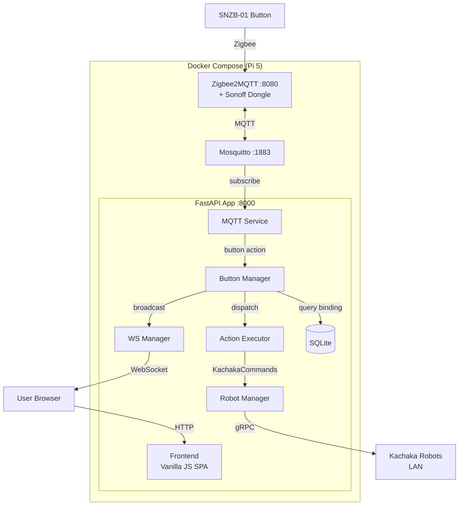

# Zigbee Button → Kachaka Robot Controller

**Date**: 2026-03-26
**Status**: Approved

## Overview

Pi 5 上執行的應用，讓 Zigbee 按鈕（SNZB-01）透過 Web UI 配對並綁定 Kachaka 機器人動作。按下按鈕即觸發對應的機器人指令。

## Goals

1. Pi 5 可透過 kachaka-sdk-toolkit 控制多台 Kachaka 機器人
2. Web UI 提供 Zigbee 按鈕配對介面
3. 每個已配對按鈕的三種觸發方式（單擊/雙擊/長按）可各自綁定一個 Kachaka 動作

## Tech Stack

- **Backend**: FastAPI + lifespan, Python 3.12
- **Frontend**: Vanilla JS SPA (static files, no build tool)
- **Zigbee**: Zigbee2MQTT + Mosquitto (MQTT broker)
- **Robot SDK**: kachaka-sdk-toolkit (`kachaka_core`)
- **Database**: SQLite + aiosqlite + versioned migrations
- **MQTT client**: aiomqtt
- **Deployment**: Docker Compose (3 containers)
- **CI**: GitHub Actions — cross-compile amd64 + arm64, push to GHCR

## Architecture



### Data Flow: Button Press → Robot Action

1. SNZB-01 按下 → Zigbee2MQTT 收到 → MQTT 發布 `zigbee2mqtt/{ieee_addr}` with `{"action": "single"}`
2. MQTTService 收到 → 用 device IEEE 地址呼叫 ButtonManager
3. ButtonManager 查 `bindings` 表：找到 `(button_id, trigger)` → `(robot_id, action, params)`
4. ActionExecutor 從 RobotManager 取得對應的 `KachakaCommands` → 執行指令
5. 結果寫入 `action_logs` 表 + WebSocket 推送到前端

## Database Schema

三張表，所有表從 day one 就有 robot_id 或明確的外鍵關聯。

### robots

| Column | Type | Description |
|--------|------|-------------|
| id | TEXT PK | 使用者自訂 ID (e.g. "kachaka-1") |
| name | TEXT NOT NULL | 顯示名稱 |
| ip | TEXT NOT NULL | Robot IP |
| enabled | BOOLEAN DEFAULT TRUE | 是否啟用 |
| created_at | TEXT NOT NULL | ISO 8601 |

### buttons

| Column | Type | Description |
|--------|------|-------------|
| id | INTEGER PK AUTOINCREMENT | 自增 ID |
| ieee_addr | TEXT UNIQUE NOT NULL | Zigbee IEEE 位址 |
| name | TEXT | 使用者自訂名稱 |
| paired_at | TEXT NOT NULL | 配對時間 |
| battery | INTEGER | 電池百分比 |
| last_seen | TEXT | 最後回報時間 |

### bindings

| Column | Type | Constraint | Description |
|--------|------|------------|-------------|
| id | INTEGER PK AUTOINCREMENT | | |
| button_id | INTEGER | FK → buttons.id | 按鈕 |
| trigger | TEXT | "single" / "double" / "long" | 觸發方式 |
| robot_id | TEXT | FK → robots.id | 目標機器人 |
| action | TEXT | NOT NULL | 動作類型 |
| params | TEXT | JSON | 動作參數 |
| enabled | BOOLEAN | DEFAULT TRUE | 是否啟用 |
| created_at | TEXT | | |

**Constraint**: `UNIQUE(button_id, trigger)` — 每個按鈕每種觸發只能綁一個動作。

### action_logs

| Column | Type | Description |
|--------|------|-------------|
| id | INTEGER PK AUTOINCREMENT | |
| button_id | INTEGER FK | 觸發的按鈕 |
| trigger | TEXT | single/double/long |
| robot_id | TEXT | 目標機器人 |
| action | TEXT | 執行的動作 |
| params | TEXT | JSON 參數 |
| result_ok | BOOLEAN | 成功/失敗 |
| result_detail | TEXT | 成功/錯誤訊息 |
| executed_at | TEXT | ISO 8601 |

## Supported Actions

| action | params | SDK method |
|--------|--------|------------|
| `move_to_location` | `{"name": "Kitchen"}` | `cmds.move_to_location(name)` |
| `return_home` | `{}` | `cmds.return_home()` |
| `speak` | `{"text": "你好"}` | `cmds.speak(text)` |
| `move_shelf` | `{"shelf": "A", "location": "Room"}` | `cmds.move_shelf(shelf, location)` |
| `return_shelf` | `{"shelf": "A"}` | `cmds.return_shelf(shelf)` |
| `dock_shelf` | `{}` | `cmds.dock_shelf()` |
| `undock_shelf` | `{}` | `cmds.undock_shelf()` |
| `start_shortcut` | `{"shortcut_id": "xxx"}` | `cmds.start_shortcut(shortcut_id)` |

## Backend Services

### main.py — FastAPI + lifespan

啟動順序：
1. `database.connect()` + `run_migrations()`
2. `robot_manager.load_from_db()` — 連線所有 enabled robots
3. `mqtt_service.start()` — 連線 Mosquitto，訂閱 `zigbee2mqtt/#`
4. `button_manager.start()` — 註冊 MQTT callback

Shutdown 逆序。

### MQTTService (`services/mqtt_service.py`)

- 使用 `aiomqtt` 連線 Mosquitto
- 訂閱 `zigbee2mqtt/#`
- 過濾按鈕 action 事件（payload 含 `"action"` 欄位）
- 偵測新設備加入（`zigbee2mqtt/bridge/event` with `type: "device_joined"`）
- 控制 `permit_join`：publish to `zigbee2mqtt/bridge/request/permit_join`

### ButtonManager (`services/button_manager.py`)

- 處理新設備配對（寫入 buttons 表）
- 收到按鈕 action → 查 bindings 表
- 找到綁定 → 呼叫 ActionExecutor
- 記錄結果到 action_logs 表
- 透過 WSManager 推送狀態

### ActionExecutor (`services/action_executor.py`)

- `ACTION_MAP` 字典：action string → KachakaCommands 方法
- 從 RobotManager 取得連線
- 執行並回傳 `{"ok": bool, ...}`

### RobotManager (`services/robot_manager.py`)

- 遵循 kachaka-app-architecture 的 RobotManager pattern
- `dict[robot_id → RobotService]`
- 每個 RobotService 持有 `KachakaConnection.get(ip)` + `KachakaCommands` + `KachakaQueries`
- 動態新增/移除 robot
- 提供 queries（locations、shortcuts、battery）供前端 API 使用

### WSManager (`services/ws_manager.py`)

- WebSocket 連線管理
- 廣播事件：`pair_started`、`device_paired`、`action_executed`、`robot_status`

## Routers (API)

| Router | Endpoints | Description |
|--------|-----------|-------------|
| `robots.py` | `GET/POST/PUT/DELETE /api/robots` | 機器人 CRUD。GET 包含在線狀態。POST 時自動 ping 驗證 |
| `robots.py` | `GET /api/robots/{id}/locations` | 從機器人即時拉取位置清單 |
| `robots.py` | `GET /api/robots/{id}/shortcuts` | 從機器人即時拉取 shortcut 清單 |
| `buttons.py` | `GET/DELETE /api/buttons` | 按鈕列表/移除 |
| `buttons.py` | `POST /api/buttons/pair` | 啟動配對模式（permit_join 120s） |
| `buttons.py` | `POST /api/buttons/pair/stop` | 停止配對 |
| `buttons.py` | `PUT /api/buttons/{id}` | 重命名按鈕 |
| `bindings.py` | `GET/PUT /api/bindings/{button_id}` | 取得/更新按鈕的三個 trigger 綁定 |
| `logs.py` | `GET /api/logs` | 執行記錄（分頁） |
| `ws.py` | `WebSocket /ws` | 即時事件推送 |

## Frontend (Vanilla JS SPA)

4 個 Tab 頁面：

### Tab 1: 機器人管理
- 列表顯示已註冊機器人（名稱、IP、在線狀態、電量）
- 新增：輸入名稱 + IP → POST 後自動 ping 驗證
- 編輯/刪除

### Tab 2: 按鈕管理
- 已配對按鈕列表（名稱、IEEE 位址、電量、最後回報時間）
- 「開始配對」按鈕 → 啟動 permit_join → WebSocket 即時顯示新設備
- 配對模式有倒數計時（120s）和停止按鈕
- 重命名/移除按鈕

### Tab 3: 綁定設定
- 下拉選按鈕 → 顯示三個 trigger slot（單擊/雙擊/長按）
- 每個 slot：選機器人 → 選動作 → 填參數
- 選 `move_to_location` 時，自動從 API 拉該機器人的位置清單
- 選 `start_shortcut` 時，自動拉 shortcut 清單
- 儲存按鈕

### Tab 4: 執行記錄
- 表格：時間、按鈕名稱、動作、機器人、結果（成功/失敗）
- 分頁載入

### 即時更新
- `websocket.js` 管理 WebSocket 連線
- 收到事件自動更新對應的 Tab 內容（配對、執行結果等）

## Project Structure

```
pi-zigbee/
├── src/
│   ├── backend/
│   │   ├── main.py
│   │   ├── routers/
│   │   │   ├── robots.py
│   │   │   ├── buttons.py
│   │   │   ├── bindings.py
│   │   │   ├── logs.py
│   │   │   └── ws.py
│   │   ├── services/
│   │   │   ├── robot_manager.py
│   │   │   ├── mqtt_service.py
│   │   │   ├── button_manager.py
│   │   │   ├── action_executor.py
│   │   │   └── ws_manager.py
│   │   ├── database/
│   │   │   ├── connection.py
│   │   │   └── migrations.py
│   │   └── utils/
│   │       └── logger.py
│   └── frontend/
│       ├── index.html
│       ├── css/
│       │   └── style.css
│       └── js/
│           ├── app.js
│           ├── robots.js
│           ├── buttons.js
│           ├── bindings.js
│           ├── logs.js
│           └── websocket.js
├── data/                              # Runtime (gitignored)
├── zigbee2mqtt/
│   └── configuration.yaml
├── mosquitto/
│   └── mosquitto.conf
├── docker-compose.yml                 # Dev: local build + live reload
├── docker-compose.override.yml        # Dev: volume mount src/
├── Dockerfile
├── deploy/
│   ├── docker-compose.yml             # Prod: pull from GHCR
│   ├── .env.example
│   ├── daemon.json                    # IPv4 enforcement
│   └── setup.sh                       # First-time setup
├── .github/
│   └── workflows/
│       └── build.yml                  # CI: cross-compile + push GHCR
├── requirements.txt
├── .env.example
└── .gitignore
```

## Deployment

### Development (local / WSL)

```bash
docker compose up --build     # Build + start all 3 containers
# override.yml auto-applied: src/ mounted, --reload enabled
```

Zigbee dongle 可選（開發時沒有 dongle 也能啟動，MQTT service 正常運行但收不到按鈕事件）。

### Production (Pi 5)

**首次部署**：
1. SSH 到 Pi → 執行 `deploy/setup.sh`（安裝 Docker, 設定 daemon.json）
2. 複製 `deploy/` 到 `/opt/app/pi-zigbee/`
3. 建立 `.env`，確認 Zigbee dongle 路徑
4. `docker compose pull && docker compose up -d`

**後續更新**：
```bash
# Push to main → GitHub CI auto-build → then:
ssh sigma@192.168.50.5 "cd /opt/app/pi-zigbee && docker compose pull && docker compose up -d"
```

### GitHub CI

- Trigger: push to `main`
- Cross-compile: `linux/amd64` + `linux/arm64`
- Push to GHCR: `latest` + git SHA 雙 tag
- Pi 上只需 `docker compose pull`，不 build

### Docker Config

**Dev** (`docker-compose.yml` + `override.yml`):
- 3 containers: Mosquitto, Zigbee2MQTT, App
- App: local build, volume mount `src/`, `--reload`

**Prod** (`deploy/docker-compose.yml`):
- 3 containers: same topology
- App: `image: ghcr.io/sigma-snaken/pi-zigbee:latest`
- IPv4 forced: `dns: [8.8.8.8, 1.1.1.1]` + `sysctls: net.ipv6.conf.all.disable_ipv6=1`
- `restart: unless-stopped`

## Dependencies

```
kachaka-sdk-toolkit
fastapi
uvicorn[standard]
aiosqlite
aiomqtt
```

## Key Rules

- All robot operations through `kachaka_core` — never use `KachakaApiClient` directly
- `KachakaConnection.get(ip)` — pooled, thread-safe
- `--workers 1` — robot is the bottleneck
- Robot IP stored in DB, managed via Web UI — never hardcoded
- `kachaka-sdk-toolkit` installed as dependency — never copy `kachaka_core/`
